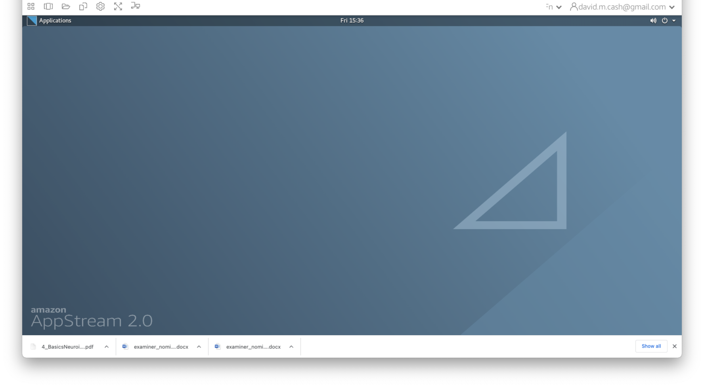

:::::::::::::::::::::::::::::::::::::: questions 

- What is the command line interface?
- Why is it helpful in neuroimaging analysis?
- What are some common commands that I need to know?

::::::::::::::::::::::::::::::::::::::::::::::::

::::::::::::::::::::::::::::::::::::: objectives

- Discover how to interact with files and directories on the command line
- Identify benefits that the command line can provide in processing image data.

::::::::::::::::::::::::::::::::::::::::::::::::

## Introduction: Why use the command line?
In order to get started with neuroimaging analysis, it is really helpful to 
first understand how to interact with a computer on the command line called 
the shell. At first look, it's pretty bare bones and minimalist. How can this 
simple way of interacting with a computer be so useful?

{alt="Picture of the command line"}

Nowadays, we usually interact with a computer using a *Graphical User Interface*
or a GUI. These include programs like Word, Chrome, iTunes which allow you to 
interact using your mouse to press buttons, select options, move sliders, 
change values, etc. It provides a simple, intuitive way for us to access the 
essential functionality that we need from these programs. Some neuroimaging 
analysis software does comes with a GUI, like this one from the [Statistical 
Parametric Mapping (SPM)](https://www.fil.ion.ucl.ac.uk/spm/) toolbox, 
a popular MATLAB based package.

{alt="Example of the SPM GUI"}

### Benefits of the command line
While GUIs are often the best way to interact with your computer, using the 
command line for neuroimaging analysis is tremendously powerful for many reasons:

1. **Automation** GUIs typically will wait until you tell them what to do. 
When you go home at night, it won't do anything because it has no instructions! 
You can setup the command line to automate some tasks so that it works late in 
the night while you are sleeping. 
1. **Scalability** Working with a GUI often means a lot of mouse moves and 
clicks. For a small handful of imaging sessions, this is a fine way to work, 
but what if your research project has *hundreds* of datasets to process. It's 
far more likely that an error could occur or a dataset is missed. While you go 
through the lessons in this workshop, count the number of mouse clicks it 
takes you to do a task and think about how that would scale to your project. 
When you run on the command line it has all of the information it needs, so no 
interaction is needed, saving a lot of your time.
1. **Control** With GUIs, you have access to the functionality that the GUI
provides you. However, hidden from the GUI may be more advanced options that you
need for your research. For the sake of more software that is often more 
user-friendly for the majority of tasks you are looking to do, the GUI can
sometimes be restritie. With the command line, you should have access to more,
if not all, of the functionality that the software provides, and thus more
control over how the task is run. It may take some investigation on your part, though.
1. **Interoperability** You may find that you want to take results from one 
program and feed them into another and then another. With GUI's this often 
means saving or exporting the results, then opening up the other program and 
importing them. The command line often allows you the means to piece these steps together
in one set of instructions.  

## Getting started
In this section, we are going to go through some basic steps of working with the
command line. Make sure you are able to connect to your working environment by 
following the directions in the [Setup](../learners/setup.md) section of this 
website. As a reminder, you should have a desktop on your virtual machine that
looks something like this:
{alt="Screenshot of the VM desktop"}
Click on the `Applications` icon in the top left of the window, and you should
see a taskbar pop out on the left-hand side. One of the icons is a 
black box with a white border. This icon will launch the `Terminal` and give 
you access to the command line. 
{alt="Launching a terminal"}

## Navigating the file structure
The terminal should produce a window with a white background and black text.
This is the shell. We will enter some commands and see what responses 
that the computer provdes.
{alt="Picture of an open terminal"}

1. The first thing we are going to do is figure out our present location in the 
file system of the computer. We do that 
using the command `pwd` which stands for *present working directory*. Type it 
in the command line and see what the response is:

    ```bash
    pwd
    ```

    ```output
    /home/as2-streaming-user
    ```
    This directory is also known as your *home directory*
1. Next we are going to see what items are contained in this directory. To do 
that, simply type `ls` and it should show you all the files.
   
    ```bash
    ls
    ``` 
    ```output
    Background.png  data  MyFiles  test
    ```
    
    You will notice that some of the entries are different colors. The colors 
    indicate whether the entries are files or directories. They also can 
    indicate if these files or directories have special properties. 
1. If we want more information about these files and directories, then we can 
use the same command with a *command line option* `-l` to tell the computer 
to list the files in a long format

    ```bash
    ls -l
    ```
    ```output
    total 60
    -rw-r--r-- 1 as2-streaming-user as2-streaming-user 57734 Jun 28  2023 Background.png
    drwxrwxrwx 8 as2-streaming-user as2-streaming-user   142 Jun 22  2023 data
    drwxr-xr-x 2 as2-streaming-user as2-streaming-user    46 Jul  8 22:31 MyFiles
    drwxr-xr-x 2 as2-streaming-user as2-streaming-user     6 Jun 16  2023 test
    ```
    This now gives a lot more information, with the letters before the file
    telling us about who owns the file (3rd and 4th column), what permissions 
    they have to read, write or run (execute) the file (first column),and when 
    it was modified (6th column). 

    If you want to list the contents of a different directory, just put it 
    after the `ls -l`
    
    ```bash
    ls -l data
    ```
    ```output
    total 8
    drwxr-xr-x 6 as2-streaming-user as2-streaming-user   84 Jun 16  2023 DiffusionMRI
    drwxr-xr-x 2 as2-streaming-user as2-streaming-user 4096 Jul  4  2023 ExtraStructuralMRI
    drwxr-xr-x 3 as2-streaming-user as2-streaming-user   26 Jun 27  2023 FunctionalMRI
    drwxr-xr-x 2 as2-streaming-user as2-streaming-user 4096 Jun 16  2023 ImageDataVisualization
    drwxr-xr-x 5 as2-streaming-user as2-streaming-user   77 Jul  7  2023 PETImaging
    drwxr-xr-x 2 as2-streaming-user as2-streaming-user  120 Jun 27  2023 StructuralMRI
    ```

1. The `data` directory is a sub-directory within your home directory where 
you will be storing your work. So let us move into that directory using the 
`cd` or *change directory* command:

    ```
    cd data
    ```
    Now type the command `pwd` again. Has the result changed?
    
    What happens when we list the contents of this directory?
    
    ```bash
    ls -l
    ```
    You should get the same result as when you ran `ls -l data` from your
    home directory.
1. Inside the data directory, let's create a new directory that we will call
`mywork`. We do that using a command called `mkdir`,

    ```bash
    mkdir mywork
    ```
:::::::::::::::::::: challenge
Run the `ls` command again to see how the contents have now changed 
to show your new directory.
::::::::::::::::::::::::::::::

### Absolute versus Relative Paths
Locations in the file system, whether they are files or directories,
are known as paths. Paths can be referred to in *absolute* terms 
(like a postal address or latitude and longitude) or *relative* terms (like 
directions to your work from home). In some cases it is more convenient to 
use absolute paths, and in others, relative paths are nicer. Absolute paths 
always begin with a `/` character. From your home directory, the following two 
commands do the exact same thing.

```bash
# Using an absolute path - this will work anywhere
ls /home/as2-streaming-user/data
```
```output
DiffusionMRI        FunctionalMRI           mywork      StructuralMRI
ExtraStructuralMRI  ImageDataVisualization  PETImaging
```

```bash
# Using a relative path - this will only work if you are in the 
# directory where data is located
ls data
```
```output
DiffusionMRI        FunctionalMRI           mywork      StructuralMRI
ExtraStructuralMRI  ImageDataVisualization  PETImaging
```
### Helpful hints
* **Feeling lost?** You can always get back to your home directory simply by 
typing `cd` without any arguments or by using the tilde symbol, which is the
shortcut for home.

    ```bash
    cd
    cd ~
    ```
* **Help me!** If you want to know more about a command, just type 
`man` in front of it to get the *manual entry*.

    ```bash
    man ls
    man find
    man more
    man less
    ```
    
* **Previous commands** If you want to see a list of commands that you have
run, you can type in the `history` command. You can also scroll through previous
commands by tapping the up and down arrow keys and then hit Return when you 
found the command you want to run again.


## Processing files
In this section, we will go over how to copy and view the contents of the files.
There is some helpful information about one of the images in our Structural MRI
lesson that we want to look at in more detail. 

1. Let's copy it over from the directory it is currently located into our new 
`mywork` directory. We do this using the `cp` or *copy* command. We first 
specify the *source*, or the file/directory that we want to copy 
(`data/StructuralMRI/sub-OAS30003_T1w.json`), and then we specify the 
destination path where we want to make the copy (`data/mywork`). **Before we 
do this command, let's make sure we are back in the home directory first** 

    ```bash
    # Go back to the home directory
    cd
    # Copy the file.
    cp data/StructuralMRI/sub-OAS30003_T1w.json data/mywork
    ```
1. Now let us confirm that the copy of the file is where we expect it to be:

    ```bash
    ls data/mywork/
    ```
    ```output
    sub-OAS30003_T1w.json
    ```
1. Finally, let's look at the contents of the file. We can do that with the 
command `cat` which concatenates and prints files.

    ```bash
    cat data/mywork/sub-OAS_30003_T1w.json 
    ``` 
    
:::::::::::::::::::: spoiler
### That just flew off the screen!
Using `cat` on a large text file can end up looking impressive as text
swarms all over your terminal, but it can be hard to examine the file...

```output
{
    "Modality": "MR",
    "MagneticFieldStrength": 3,
    "Manufacturer": "Siemens",
    "ManufacturersModelName": "Biograph_mMR",
    "DeviceSerialNumber": "51010",
    "PatientPosition": "HFS",
    "SoftwareVersions": "syngo_MR_B18P",
    "MRAcquisitionType": "3D",
    "SeriesDescription": "MPRAGE_GRAPPA2",
    "ScanningSequence": "GR_IR",
    "SequenceVariant": "SP_MP",
    "ScanOptions": "IR",
    "SequenceName": "_tfl3d1_ns",
    "ImageType": [
        "ORIGINAL",
        "PRIMARY",
        "M",
        "ND",
        "NORM"
    ],
    "AcquisitionTime": "11:53:18.945000",
    "AcquisitionNumber": 1,
    "SliceThickness": 1.2,
    "SAR": 0.0397884,
    "EchoTime": 0.00295,
    "RepetitionTime": 2.3,
    "InversionTime": 0.9,
    "FlipAngle": 9,
    "PartialFourier": 1,
    "BaseResolution": 256,
    "ShimSetting": [
        -6853,
        14225,
        -5859,
        -89,
        -201,
        157,
        585,
        -236
    ],
    "TxRefAmp": 307.072,
    "PhaseResolution": 1,
    "ReceiveCoilName": "HeadNeck_MRPET",
    "PulseSequenceDetails": "%SiemensSeq%_tfl",
    "PercentPhaseFOV": 93.75,
    "PhaseEncodingSteps": 239,
    "AcquisitionMatrixPE": 240,
    "ReconMatrixPE": 256,
    "ParallelReductionFactorInPlane": 2,
    "PixelBandwidth": 238,
    "DwellTime": 8.2e-06,
    "ImageOrientationPatientDICOM": [
        0,
        1,
        0,
        0,
        0,
        -1
    ],
    "InPlanePhaseEncodingDirectionDICOM": "ROW",
    "ConversionSoftware": "dcm2niix",
    "ConversionSoftwareVersion": "v1.0.20171017 GCC4.4.7"
```
If we want to have a bit more control over how we view larger files, then we 
can use either the `more` or `less` command. This allows you to scroll through
the file a line or page at a time, go back, search the text, etc. 

```bash
more data/mywork/sub-OAS_30003_T1w.json 
```

:::::::::::::::::::::::::::::::

1. We no longer need that file anymore (remember it is just a copy), so we can 
remove files by using the `rm` command, but **BE CAREFUL** and check the command
twice before executing the command, as this cannot be undone! Watch out for any 
spaces or any special characters like the `*` and `?` as they mean something 
special in the shell, and including them in a remove command may remove
more files than you intended.

    ```bash
    rm data/mywork/sub-OAS_30003_T1w.json 
    ```

## Further reading
If you want to find out more how to use the command line, please check out the 
following helpful resources:

* ["The Unix Shell" Software Carpentry lesson](https://swcarpentry.github.io/shell-novice/)
* [Bash guide for beginners](https://tldp.org/LDP/Bash-Beginners-Guide/html) 

## Stretch exercises
As you get more comfortable, you can start to do powerful things with the command line.

::::::::::::::::::::::challenge
### Variables
Sometimes we want to store some information for future use. We can do that 
with a variable. A variable has a name and a value. A variable in the shell can 
hold a number, a single character, a word, sentence or a list of things. You 
*assign* a value to a variable with a simple statement `var=value` where you 
replace var with the name that you want to call the variable and replace value 
with the value you want to store. Once the variable has been assigned, you can 
access the value within the variable by putting a `$` in front of the variable name

```bash
image="T1"
echo "My favorite images are $image scans."
```
```output
My favorite images are T1 scans.
```
See how it replaces `$image` with T1. Let's do it again and assign a new value to `image`.
```bash
image="DTI"
echo "My favorite images are $image scans."
```
```output
My favorite images are DTI scans.
```
::::::::::::::::::::::

:::::::::::::::::::::: challenge
### Looping
Variables are really helpful when we want to set up a loop. Let's say we have 
images from 100 different subjects who are in our study, and we want to make 
sure that we process each of the images in the exact same way. You could type 
the commands out 100 times, where in each set of commands, you change the name 
of the image files. As you could imagine, that would be really boring, and 
there is definitely more risk of an error being introduced. A loop is a 
solution to this and makes your command writing much simpler. It is simply an 
instruction to the shell that says run the same command a bunch of times. 
```bash
for name in David Ludovica Tobey Alexa Luigi
do
    echo "Hey ${name}, I need help!"
done
```
```output
Hey David, I need help!
Hey Ludovica, I need help!
Hey Tobey, I need help!
Hey Alexa, I need help!
Hey Luigi, I need help!
```
Here, the loop is setup with a `for` command, with the format 
`for (var) in (list)` where (var) is the *variable name*, and its value will 
change with each iteration of the loop and (list) holds the list of entries 
that you want to loop over. The for loop will determine how many entries are in 
the list. At each iteration, it will place the next value of the 
list in to the variable (in our example `name`) and execute the commands that 
are inside the keywords `do` (start the loop) and `done` (end the loop).
::::::::::::::::::::::::::

:::::::::::::::::::::::::: challenge
### Redirection
Quite often, when you execute a command on the shell, it prints out information 
on the screen that is useful to  store for later. You can store them in the 
file using *redirection*. The `>` says redirects the output from the screen to 
another location, such as a file, overwriting the current contents. The `>>` 
does the same thing but it just appends the contents at the end. This loop just 
prints the number and its square on the screen.
```bash
for i in 1 2 3 4 5 6 7 8 9 10
do 
    let j=i*i
    echo $i $j
done
```
```output
1 1
2 4
3 9
4 16
5 25
6 36
7 49
8 64
9 81
10 100
```
This loop does the same thing but saves it to a text file called `squares.txt`
```bash
for i in 1 2 3 4 5 6 7 8 9 10
do 
    let j=i*i
    echo $i $j >> squares.txt
done
```
Now if we show the contents of `squares.txt`, we see it has the same information.
```bash
cat squares.txt
```
```output
1 1
2 4
3 9
4 16
5 25
6 36
7 49
8 64
9 81
10 100
```
Redirection can also be used for getting input using the `<` character. This finds the line where 64 is the answer.
```bash
grep 64 < squares.txt
```
```output
8 64
```
Finally you can redirect output from one command into input of another command 
using the pipe character, `|`. In this case we are directing the output from 
the `echo` command from the screen to the input of the calculator command `bc`.
```bash
echo "242*242" | bc
```
```output
58564
```
::::::::::::::::::::::::::::::

## Command line cheatsheet

| Command | Name | Function | Example Usage | 
| --- | --- | --- | --- |
| man | Manual | HELP! | `man cd` |
| pwd | Print working directory | Where am I? | `pwd` |
| mkdir | Make directory | Create a new directory | `mkdir dir1` |
| cd | Change directory | Go to the following location | `cd dir1` |
| ls | List | Shows what is inside a directory | `ls dir1` |
| cp | Copy | Copies a source file to a new destination | `cp src dest` |
| mv | Move | Moves a source file to a new destination | `mv source destination` |
| rm | Remove | Deletes a file or a directory | `rm dir1/bad_file` |
| cat | Concatenate | Prints out the contents of a file | `cat results.txt` |
| more | more | Prints out the contents of a file. Better for large files to scroll | `more results.txt` |
| nano, emacs, gedit | Text editor | Programs that edit plain text files (no formatting) | `emacs dir1/inputs.txt` `nano dir1/inputs.txt` |

::::::::::::::::::::::::::::::::::::: keypoints 

- The command line interface is a low-level way of interacting with your computer
- It provides more control, more reliability, and more scalability than 
manually interacting with a graphical user interface. 
- Paths can be specified in two ways: an *absolute* path and a *relative* path.
The absolute path remains the same regardless of the current location, where
the relative path will change. 
- Help can be found by typing the man command
::::::::::::::::::::::::::::::::::::::::::::::::

