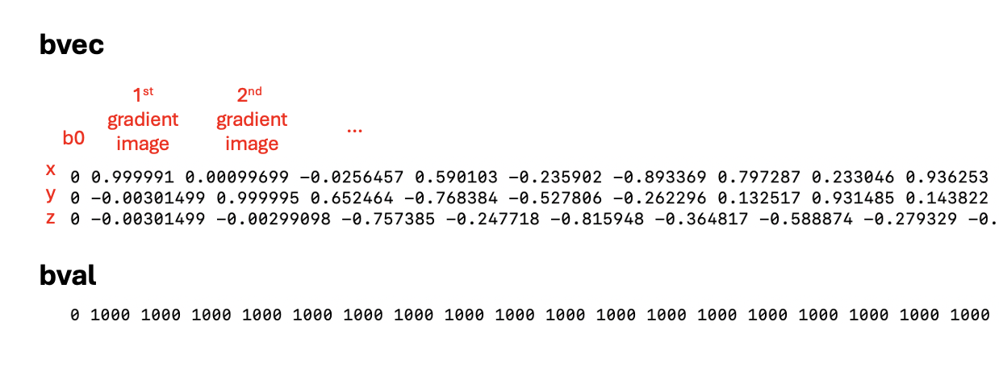
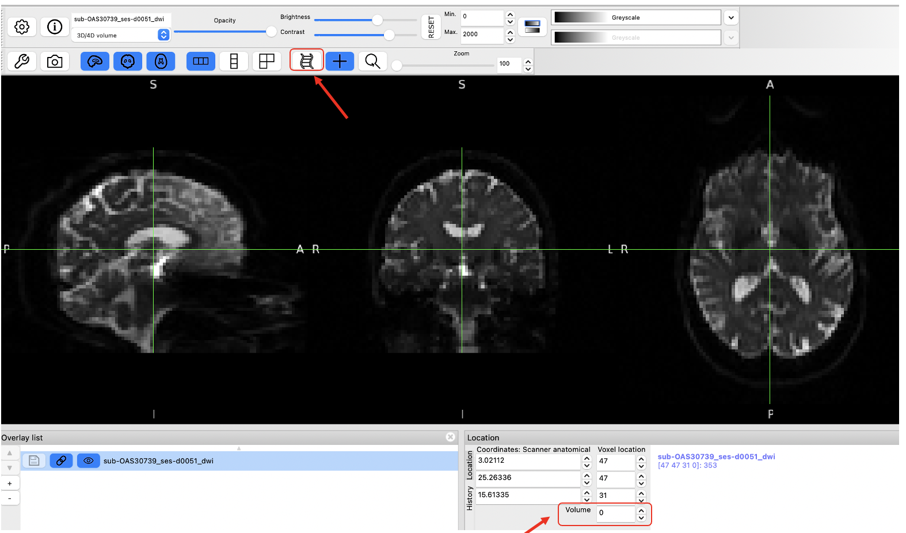

:::::::::::::::::::::::::::::::::::::: questions 

- What does diffusion weighted imaging measure?
- What processing steps are needed when working with diffusion weigthed imaging data? 
- What types of analyses are used with diffusion imaging in dementia resaerch?

::::::::::::::::::::::::::::::::::::::::::::::::

::::::::::::::::::::::::::::::::::::: objectives

- Understand the processing steps in diffusion-weighted MRI scans
- Perform basic analyses on white matter microstructure. 


::::::::::::::::::::::::::::::::::::::::::::::::

## Introduction

We will use the FSL diffusion toolbox to perform the processing steps that 
are core to most diffusion weighted imaging analyses:

* image visualization of raw data and analysis outputs,
* eddy correction,
* generation of diffusion tensor metrics brain maps,
* tract-based spatial statistics,
* you can also stretch your knowledge and familiarize yourself with loops to run these commands on multiple subjects, all shown at the end of this tutorial
  
We are going to be working in the DiffusionMRI subfolder under data in your home directory, `~/data/DiffusionMRI`. 

## Looking at the raw data
From the previous lessons, you learned how to view and navigate images, let's first look at the raw data, which can all be found under `~/data/DiffusionMRI/sourcedata`.

To go to this directory using the terminal, use the command `cd` to change directory. 
Type `cd  ~/data/DiffusionMRI/sourcedata` to go this directory.

Let's inspect what each participant's dwi directory should contain: 
```bash
ls sub-OAS30001/dwi
```
or 
```bash
ls sub-OAS*/dwi
 ```
The `*` will match any following text, which here will list the contents of any directory starting with "sub-OAS".
 
Each directory should contain 4 files: 

* one `.bval` text file
* one `.bvec` text file
* one `.json` text file
* one nifti (`.nii.gz`) image file

All files are required for processing DWI data except the .json file. The `.json` file is specific to the [BIDS](https://bids.neuroimaging.io/) data organization, and is a useful way to access data description. More and more software are also relying on data organized according to the BIDS structure.

Let's look at those files:
```bash
# Change directory to go in one participant's folder
cd sub-OAS30001/dwi

## Image file
fsleyes sub-OAS30001_dwi.nii.gz
 
## Text files
cat sub-OAS30001_ses-d2430_dwi.bval
cat sub-OAS30001_ses-d2430_dwi.bvec
```
:::::::::::::::::::: spoiler
### The command should show the following content

{alt="example of bval and bvec file"}

* The nifti file is a 4D file of all the directions acquired.
* The `.bval` file refers to the *b-value* applied to each image.
* The `.bvec` file refers to the *vector* applied to each image, with the coordinates in x, y and z.
::::::::::::::::::::

:::::::::::::::::::: challenge
Use the "movie" option in fsleyes to look at all frames of the nifti file. 
How can you know how many directions it contains?

:::::::::::::::::::: hint
Refer to the [Getting started session](imaging-data-structure-and-formats.md) 
for more details!
:::::::::::::::::::::::::

:::::::::::::::::::: solution
There is 1 b0 image and 64 gradient images! You can check for the maximum number as you move through the "Volume" box as shown below.

{alt="FSLeyes of B0 image"}
:::::::::::::::::::::::::::::

:::::::::::::::::::::::::::::

## Data preprocessing

We are now ready to start data pre-processing, which we will do using the FSL Diffusion Toolbox.
Most of the steps and explanation below are adapted from the excellent tutorial provided FSL, please refer to it for more details: <https://open.win.ox.ac.uk/pages/fslcourse/practicals/fdt1/index.html>

All the steps below will be done on one subject only, but if you wish to loop the different steps across multiple participants, refer to the section [Stretch your knowledge](#stretch-your-knowledge) at the end.

### 1. Creating a brain mask from the b0 images

We often use the b0 images (there is only 1 b0 image in this dataset) to create a brain mask that is needed in future steps.
First select the b0 image, extract the brain only and binarize it to make a mask.

* Extract the b0 image only with select_dwi_vols or fslroi

   ```bash
   # Usage: fslroi <input> <output> <tmin> <tsize>

   fslroi sub-OAS30001_dwi.nii.gz sub-OAS30001_b0.nii.gz 0 1
   ```

* Brain extraction and binarization with bet

   ```bash
   # Usage: bet <input> <output> [options] 
   # the -m option will automatically create a binarized mask after brain extraction

   bet sub-OAS30001_b0.nii.gz sub-OAS30001_b0_bet -m
   ```

* Load the mask you just created to make sure it is adequate!

   ```bash
   fsleyes sub-OAS30001_b0_bet_mask.nii.gz
   ```

### 2. Correcting for susceptibility-induced distortions

Some parts of the brain can appear distorted depending on their magnetic properties. One common way to correct the distortions with DWI data is by acquiring a b0 image acquired with a different phase-encoding, and merging the two types of images running [TOPUP](https://fsl.fmrib.ox.ac.uk/fsl/fslwiki/topup).

In this dataset we don't have the data required for TOPUP so we will skip this step.

*Note however that you should run it if your data allows.*

### 3. Correcting for eddy currents and movement

Eddy is a tool to correct for eddy current-induced distortions and movement on the image. Eddy currents arise from electric current due to strong and fast changing gradients. Eddy also does outlier detection and will replace signal loss by non-parametric predictions. 

We need to create 2 files to be able to run eddy: 

*  an index file corresponding to the directions with the same phase encoding
*  a file with some acquisition parameters 

Run the following lines to create the index file. Since all images are obtained with the same phase encoding, it will just be a vector with values of 1 of the same length of the bval file.

```bash
## The command wc (wordcount) will check the length of the bval file and we will use this output to create the index file we need.
wc -w sub-OAS30001_dwi.bval
indx="" 
for ((i=1; i<=65; i+=1)); do indx="$indx 1"; done 
echo $indx > index.txt
```
```output
1 1 1 1 1 1 ... 1
The index file is a series of 1 repeated 65 times
```

The acquisition parameter file is a vector containing the phase encoding and the total read out time, which can all be found in the `.json` file. Do `cat sub-OAS30001_dwi.json` and see if you can find the following information.

* TotalReadoutTime: 0.0451246
* PhaseEncodingDirection: j- : This corresponds to the AP direction and is coded as -1 for the acquisition parameter file. 

You can also try `cat sub-OAS30001_dwi.json | grep 'Total'` to directly find the entry you need!

The acquisition parameter file first includes the phase encoding, with the first 3 numbers corresponding to the x, y, and z directions. Here we are acquiring along the y direction (being -1), and x and z being 0. The last number is the total read out time.

To create it you can do:

```bash
printf "0 -1 0 0.0451246" > acqparams.txt
```

We are ready to run eddy!
Please refer to <https://fsl.fmrib.ox.ac.uk/fsl/fslwiki/eddy> for all the details

However, eddy takes a long time to run (about 40 minutes either on the VM or on a MacBook Pro), so we've run it for a few subjects already. The outputs can be found in `~/data/DiffusionMRI/processed_sourcedata`. 

As eddy creates a lot of output files, it can be good practice to create a separate directory to store the outputs so we keep things more organized, as done in the `processed_sourcedata` directory. 
For example, if you type `ls ~/data/DiffusionMRI/processed_sourcedata/sub-OAS30001/eddy/` you will see all the eddy outputs for this given participant.

Eddy also takes a lot of input arguments, as depicted below\
\
*Image adapted from <https://open.win.ox.ac.uk/pages/fslcourse/practicals/fdt1/index.html>*

If you want to try to run it on one participant, you can try the following command.

```bash
eddy --imain=sub-OAS30001_dwi.nii.gz --mask=sub-OAS30001_b0_bet_mask.nii.gz --acqp=acqparams.txt --index=index.txt --bvecs=sub-OAS30001_dwi.bvec --bvals=sub-OAS30001_dwi.bval --out=../eddy/eddy_corrected
```
To be able to run the next step, we will copy the eddy-corrected DWI scan for one subject into our working directory. 
Make sure you are in this directory: `~/data/DiffusionMRI/sourcedata/sub-OAS30001/dwi` (you can use the command `pwd` to print your working directory and know where you are), and then type this command:

```bash
cp ~/data/DiffusionMRI/processed_sourcedata/sub-OAS30001/eddy/sub-OAS30001_eddy_corrected.nii.gz .
```

Now let's compare the raw DWI scan vs. after eddy correction.
You can load the two images (sub-OAS30001_dwi.nii.gz and sub-OAS30001_eddy_corrected.nii.gz) with `fsleyes`.
On this participant with high quality images, the differences are not really noticeable, but remember the example from the webinar on data where there was signal loss and big differences were evident.

** **It’s always important to inspect images after preprocessing steps! Many software (including FSL) have automated QC frameworks available to help go through all the outputs. You can find more information on eddyQC from the [FSL documentation](https://fsl.fmrib.ox.ac.uk/fsl/fslwiki/eddyqc) if you want to try it**

### 4. Generating DTI outputs

We can now fit the diffusion tensor model to the preprocessed data. This will generate all the standard DTI outputs, like fractional anisotropy (FA), mean diffusivity (MD), radial diffusivity (RD) and axial diffusivity (AD), along with eigenvectors. 

As this will also generate many outputs, to keep things organized let's create a directory for storing the outputs.

The command is `dtifit`, and uses the eddy-corrected data as input. All the inputs required are detailed in the command usage.

```bash
#Usage: Compulsory arguments (You MUST set one or more of):
#	-k,--data	dti data file
# -o,--out	Output basename
# -m,--mask	Bet binary mask file
# -r,--bvecs	b vectors file
# -b,--bvals	b values file

dtifit --data=sub-OAS30001_eddy_corrected.nii.gz --mask=sub-OAS30001_b0_bet_mask.nii.gz --bvecs=sub-OAS30001_dwi.bvec --bvals=sub-OAS30001_dwi.bval --out=../dti/sub-OAS30001_
```

Many files have been created, let's look at the ones most commonly used, i.e. FA, MD and V1.\
V1 is the principal eigenvector and corresponds to the direction along the principal diffusion direction and allows us to visualize the underlying orientation of white matter fibers.

V1 should open as an RGB map where the colors represent directions:\
* Red= left - right axis\
* Green= anterior - posterior axis\
* Blue= superior - inferior axis

You can also change the overlay type and visualize the image as lines with '3-direction vector image (Line)' in the top left corner, which will show the vector field.

Example of the V1 file in RGB:\


We have now completed the basic steps required for all diffusion data! 
Those allow to continue with further processing (e.g. tractography) or to continue with group-level analyses, which require processing a few subjects.

In the next section, you have a few options to go further:

* There is some example of code to perform the same steps as we did above, this time looping across subjects. 
* A common analyses is [Tract-Based Spatial Statistics (TBSS)](https://fsl.fmrib.ox.ac.uk/fsl/fslwiki/TBSS), which allows for voxel-wise analyses on a skeletonized white matter template. We provided the command lines below to do such analyses. Some steps can take some time to run, and thus we provided the outputs in `~/data/DiffusionMRI/tbss` if you want to examine the different steps and the final outputs.

## Stretch your knowledge

::::::::::::::::::::::::: challenge 
### Do you want to process multiple subjects?
An easy way to do this is through multiple bash loops, introduced this morning. You will have examples below of loops for the different steps we did above if you want to try it. 

Make sure you are in the following directory: `~/data/DiffusionMRI/sourcedata`

```bash
# Extract the b0 image
for x in sub-OAS30*; do echo $x; fslroi $x/dwi/*_dwi.nii.gz $x/dwi/${x}_b0.nii.gz 0 1; done

#Create the brain mask from the b0 image
for x in sub-OAS30*; do echo $x; bet $x/dwi/*_b0.nii.gz $x/dwi/${x}_b0_bet -m; done

# Run eddy - Don't try this on multiple subjects; it will take too long to run!
for x in sub-OAS30*; do echo $x; eddy --imain=$x/dwi/${x}_dwi.nii.gz --mask=$x/dwi/${x}_b0_bet_mask.nii.gz --acqp=acqparams.txt --index=index.txt --bvecs=$x/dwi/${x}_dwi.bvec --bvals=$x/dwi/${x}_dwi.bval --out=$x/dwi/${x}_eddy_corrected; done

# Run dtifit
for x in sub-OAS30*; do echo $x; dtifit --data=$x/dwi/${x}_eddy_corrected.nii.gz --mask=$x/dwi/${x}_b0_bet_mask.nii.gz --bvecs=$x/dwi/${x}_dwi.bvec --bvals=$x/dwi/${x}_dwi.bval --out=$x/dwi/${x} ; done

```

*Note that all processed data can be found in `~/data/DiffusionMRI/processed_sourcedata` if you want to access it*
::::::::::::::::::::::::::::::

::::::::::::::::::::::::: challenge 

### Do you want to investigate microstructure differences between groups? 

Let's investigate FA differences between 4 Controls and 4 AD subjects using [TBSS](https://fsl.fmrib.ox.ac.uk/fsl/fslwiki/TBSS/UserGuide). This involves a few easy steps, which are outline below, but please refer to the original description of TBSS for all details.

It can take some time to run, so we placed all outputs in `~/data/DiffusionMRI/tbss` if you want to explore the outputs from each step.\

If you want to try it on your own, you can follow these steps:

1. Create a new directory for TBSS and copy all FA maps in it
   ```bash
   mkdir tbss_tutorial
   cp ~/data/DiffusionMRI/processed_sourcedata/sub-OAS30*/dti/*FA.nii.gz tbss_tutorial/
   ```
   You can run `slicesdir *.nii.gz` and open the resulting web page report; this is a quick way to check your images.
 
   Run all the next commands directly from the tbss_tutorial directory you created.

1. Quick preprocessing of the data 
   ```bash
   tbss_1_preproc *.nii.gz
   ```
 
1. Register all FA maps to standard space
   ```bash
   tbss_2_reg -T
   ```

1. Apply transformation to all images and create mean FA skeleton
   ```bash
   tbss_3_postreg -S
   ```
   You can load the 4D file created `all_FA` with the overlay `mean_FA_skeleton` on top to verify that all images are aligned correctly.

1. threshold FA skeleton\
This last step is to threshold the FA skeleton that was created, inspect it before and adapt accordingly (here we used the recommended 0.2 threshold)
   ```bash
   tbss_4_prestats 0.2
   ```

We are now ready to do the statistical comparisons!

### Statistical comparisons between two groups
We will use the tool [randomise](https://fsl.fmrib.ox.ac.uk/fsl/fslwiki/Randomise/UserGuide), for which we need to create two text files: design.mat and design.con. **Design.mat** specifies which groups the participants belong to and other covariates of interest. **Design.con** specifies the contrasts we want to perform for our statistical analyses.

You need to make sure of the order of your FA images to create the design matrix files, which is the alphabetical order. In this example, we will compare Controls vs. AD patients. The diagnosis for each participant is as follows:\
sub-OAS30001 : Control\
sub-OAS30003 : Control\
sub-OAS30006 : Control\
sub-OAS30024 : AD\
sub-OAS30025 : Control\
sub-OAS30128 : AD\
sub-OAS30217 : AD\
sub-OAS30262 : AD

We want to perform 2-sample t-test. We can create the files we need easily with:
```bash
# Move to the stats directory
design_ttest2 design 4 4
```

**Since the order of our participants do not perfectly follow the Diagnosis categories, make sure you fix the design.mat accordingly if you used the automated command.** The final one should be:\
1 0\
1 0\
1 0\
**0 1**\
**1 0**\
0 1\
0 1\
0 1

For the design.con, the first contrast '1 -1' will give results where CU > AD and the second contrast '-1 1' will give results where the CU < AD.\ *Remember: we are looking at differences in FA, so we expect smaller FA values in AD than Controls. It would be the opposite if we were looking at differences in MD.*

We are ready do run the command `randomise` to compare groups. 
There are a lot of options you can choose to generate your results, with different thresholding options. Please refer to the full description of the command
```bash
#Usage: randomise -i <input> -o <output> -d <design.mat> -t <design.con> [options]

# Since we have only a few subjects we can apply a less stringent threshold, setting a cluster-based threshold at t= 1.5
randomise -i all_FA_skeletonised -o tbss -m mean_FA_skeleton_mask -d design.mat -t design.con -c 1.5

# Here is the example to apply the preferred method of TFCE (threshold free cluster enhancement; option T2)
randomise -i all_FA_skeletonised -o tbss -m mean_FA_skeleton_mask -d design.mat -t design.con -n 100 --T2 -V
```

We generated outputs using the two methods (cluster based threshold of TFCE), which you can access under `~/data/DiffusionMRI/tbss/stats`. You have:\
* unthresholded t-statistical maps, `tbss_tstat1 and tbss_tstat2`, where 1 and 2 refer to the different contrasts\
* p-values maps corrected for multiple comparisons (either tbss_clustere_corrp_tstatX or tbss_tfce_corrp_tstatX)\
  Note that the p-values maps are outputted as 1-p for convenience of display (so that higher values are more significant). You can threshold those from    0.95 to 1.

Here is one example of how you can overlay different outputs images to visualize results.
```bash
fsleyes -std1mm mean_FA_skeleton -cm green -dr .3 .7 tbss_tstat1 -cm red-yellow -dr 1.5 3 tbss_clustere_corrp_tstat1 -cm blue-lightblue -dr 0.90 1
```
This will display the standard MNI brain, the average FA skeleton used for TBSS, the t-map for contrast 1 and the p-value maps after cluster-based thresholding.
*Note that I am thresholding the latter from 0.90 to 1 since we have weak results in this example; this will show voxels where CU have greater FA than AD patients from p=0.10.*

Try the same thing with the other contrast to confirm if results are as expected. 
::::::::::::::::::::::::: 

::::::::::::::::::::::::::::::::::::: keypoints 

- Diffusion imaging is used to obtain measurements of tissue microstructure
- DWI consists of a 4D volume, and files describing the vectors and b-values 
that each volume is encoding
- The common core processing steps are: brain masking, susceptibility correction,
eddy/motion correction, and modelling (tensor fitting, NODDI, etc)

::::::::::::::::::::::::::::::::::::::::::::::::

