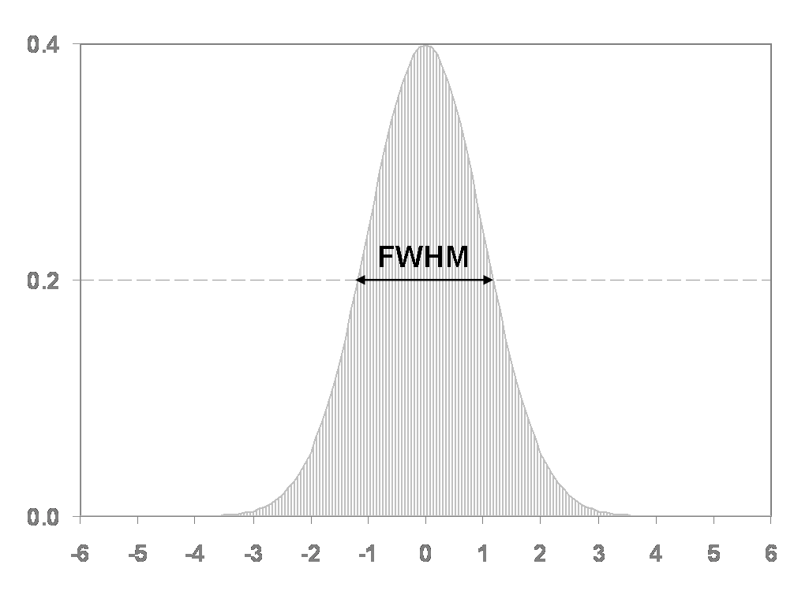
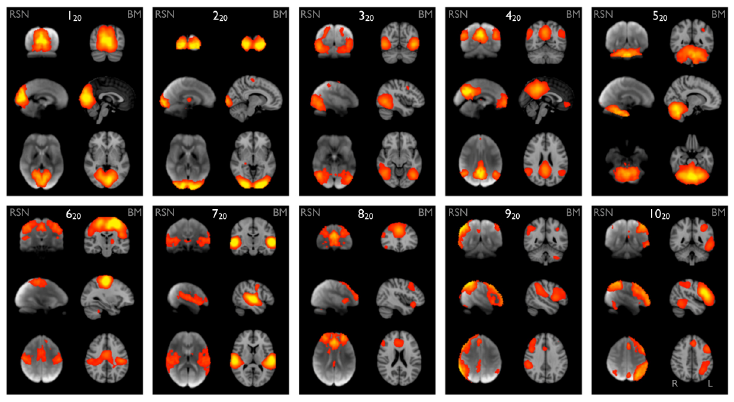

:::::::::::::::::::::::::::::::::::::: questions 

- What generates the signal that fMRI is measuring?
- What preprocessing steps are needed before analysing fMRI data?
- What type of analysis can I perform on pre-processed fMRI data?

::::::::::::::::::::::::::::::::::::::::::::::::

::::::::::::::::::::::::::::::::::::: objectives

- Explain main sources of variability in BOLD signal and how to handle them
- Demonstrate basic pre-processing steps commonly used in fMRI
- Get to know what type of information we can obtain from pre-processed data (e.g. resting state networks)

::::::::::::::::::::::::::::::::::::::::::::::::

## Introduction

Functional Magnetic Resonance Imaging (fMRI) is a technique that captures a "movie" of brain activation over a certain period of time. fMRI sequences are *time series* (4D acquisitions) of 3D brain volumes. fMRI measures the blood-oxygen-level-dependent (**BOLD**) signal, an indirect measure of regional brain metabolism. 

Raw resting-state functional MRI images are prone to several artifacts and variability sources. For this reason, before performing our statistical analysis, we need to apply a series of procedures that aim at removing the sources of signal that we are not interested in, to clean the ones we want to study. All these procedures together are called *pre-processing*.
This document will guide you through the basic steps that are usually taken in the rs-fMRI pre-processing phase.

## Pre-processing Software 
To date, a large amount of pre-processing software packages are available and can be freely used. In this course, we will use [FSL](https://fsl.fmrib.ox.ac.uk/fsl/fslwiki) to perform pre-processing steps directly from the command line. 

## Data 

In this tutorial, we are going to use data from one participant of the OASIS study. 
Data can be found in the folder `oasis/fMRI_tutorial_orig`
First, let's go into the directory where the functional data are!

```bash
cd   data/FunctionalMRI 
```

Now go into the subject folder and list the content to have an idea of what data we are going to use. 

```bash
cd sub-OAS30015

ls 
```

As you can see, for fMRI processing we need high-resolution structural data (T1w in the subfolder called `anat`) and fMRI files, in the `func` subfolder. 

## Overview
Modern fMRI pre-processing pipelines include a variety of processes that can, or cannot, be performed depending on the acquired data quality, and study design. Today, we will have a look at some of these pre-processing steps that are most commonly used.
Typical pre-processing steps include:

- EPI Distortion Correction
- Motion Correction
- Standard Space Mapping
- Spatial Smoothing
- Temporal Filtering 
- Denoising

## Hands-on

### Structural Processing
Given the low spatial resolution and SNR of fMRI images, some registration steps in functional processing involve the use of previously computed transformation during the T1w processing. Important steps to have performed are: 

**In this course, these steps have already been performed for you as they can take quite some time. Please don't run these commands!**

- Brain extraction with BET

    ```bash
    bet sub-OAS30015_T1w.nii.gz sub-OAS30015_T1w_bet -f 0.4
    ```
- Tissue Segmentation with FAST

    ```bash
    fast -n 3 -b -o sub-OAS30015_T1w_bet_FAST sub-OAS30015_T1w_bet.nii.gz
    ```
- Linear and Non linear T1w to MNI Standard Space Mapping

    ```bash
    flirt -in sub-OAS30015_T1w_bet.nii.gz  -ref /usr/local/fsl/data/standard/MNI152_T1_2mm_brain -out highres2standard -omat highres2standard.mat -cost corratio -dof 12 -searchrx -90 90 -searchry -90 90 -searchrz -90 90 -interp trilinear

    fnirt --iout=highres2standard_head --in=sub-OAS30015_T1w.nii.gz --aff=highres2standard.mat --cout=highres2standard_warp  --jout=highres2highres_jac --config=T1_2_MNI152_2mm --ref=/usr/local/fsl/data/standard/MNI152_T1_2mm --refmask=/usr/local/fsl/data/standard/MNI152_T1_2mm_brain_mask.nii.gz --warpres=10,10,10
    ```

 The results from these commands can be found in the /anat folder within the subject directory


### Look at the raw data!

To have an idea of how the raw data looks before any pre-processing is performed, let us visually review the images. 
To do so, `fsleyes` is a great toolbox that can be used by typing on the command line: 

```bash 
fsleyes func/sub-OAS30015_task-rest_run-01_bold.nii.gz &
```

As mentioned in the [imaging data](./imaging-data-structure-and-formats.Rmd) section, the `&` at the end of the command allows us to keep working on the command line while having a graphical application (such as `fsleyes`) opened. Helpful options for reviewing fMRI data in fsleyes are the movie option ( {alt="movie" height='24px'} ) and the timeseries option (-> view -> timeseries or keyboard shortcut &#8984;-3). Check them out!


### EPI Distortion Correction

Some parts of the brain can appear distorted depending on their magnetic properties. One common way to correct the distortions with fMRI data is by acquiring one volume with an opposite phase-encoding direction, and merging the two types of images running [TOPUP](https://fsl.fmrib.ox.ac.uk/fsl/fslwiki/topup). In this dataset we don’t have the data required for TOPUP so we will skip this step.
*Note however that you should run it if your data allows.*

### Preliminary steps

For some registrations steps we will need only one volume from our fMRI timeseries. 
Run the following code to cut 1 volume in the middle of the functional file: 

```bash
fslroi func/sub-OAS30015_task-rest_run-01_bold.nii.gz func/sub-OAS30015_task-rest_run-01_bold_1volume  80 1
```


### Motion Correction

A big issue in raw rs-fMRI scans is the fact that participants usually tend to move during the length of the scanning session, therefore producing artifacts in the images. 
Head motion results in lower quality (more blurry) images, as well as creating spurious correlations between voxels in the brain. 
Rs-fMRI pre-processing takes care of the motion during the scan by realigning each volume within a scan to a reference volume. The reference volume is usually the first or the middle volume of the whole sequence. 

To perform motion correction with fsl we use the `mcflirt` command: 

```bash
mcflirt -in  func/sub-OAS30015_task-rest_run-01_bold.nii.gz -out func/mc_sub-OAS30015_task-rest_run-01_bold
```
To keep track of what we are doing, it is good to add a prefix to the output describing the preprocessing steps run on it. So in this case we add `mc_` (motion corrected) to our original functional file.

we can now have a look at original and motion corrected image by typing 

```bash
fsleyes func/sub-OAS30015_task-rest_run-01_bold.nii.gz func/mc_sub-OAS30015_task-rest_run-01_bold &
```

In `fsleyes` we can use the options in the lower left panel to hide or move images up. Can you guess which are the spots of the images that differ most between the two scans?  


### Standard Space Mapping

Brain shape and size strongly vary across different individuals. 
However, to perform group level analysis, voxels between different brains need to correspond. This can be achieved by *registering* or *normalizing* rs-fMRI scans in *native-space* to a standard template. 
This processing step is actually made of three different steps. 

1. Compute the registration of the subject T1w scan to MNI space:

   This has been previously run using `flirt` and `fnirt` (see above). The output transformation matrix is stored in the `anat` subfolder and called `highres2standard_warp.mat`

1. Register the fMRI to the T1w file

   With the following function we compute the transformation matrix needed to bring the fMRI file to the T1w space

   ```bash
   epi_reg --epi=func/sub-OAS30015_task-rest_run-01_bold_1volume.nii.gz --t1=anat/sub-OAS30015_T1w.nii.gz --t1brain=anat/sub-OAS30015_T1w_bet.nii.gz --out=func/func2highres
   ```

1. Combine fMRI2T1w and T12MNI transformation, and apply in one go to our timeseries

   ```bash
   # concatenate T12standard and fMRI2T1w affine transform
   convert_xfm -omat func/func2standard  -concat anat/highres2standard.mat func/func2highres.mat  

   # concatenate T12standard non-linear and fMRI2T1w affine transform
   convertwarp --ref=$FSLDIR/data/standard/MNI152_T1_2mm_brain --premat=func/func2highres.mat --warp1=anat/highres2standard_warp --out=func/func2standard_warp 

   applywarp --ref=$FSLDIR/data/standard/MNI152_T1_2mm_brain --in=func/mc_sub-OAS30015_task-rest_run-01_bold.nii.gz  --out=func/MNI_mc_sub-OAS30015_task-rest_run-01_bold.nii.gz  --warp=func/func2standard_warp

   ```

The output of these functions is stored in `func/MNI_mc_sub-OAS30015_task-rest_run-01_bold.nii.gz` . This is our fMRI scan in MNI space. You can check this by typing 

```bash
# check characteristics (dimensions) of the MNI functional file 
fslinfo func/MNI_mc_sub-OAS30015_task-rest_run-01_bold.nii.gz  

# check characteristics (dimensions) of the native-space functional file 
fslinfo func/sub-OAS30015_task-rest_run-01_bold.nii.gz 
```

Let's also have a look at the MNI file!


```bash
fsleyes func/MNI_mc_sub-OAS30015_task-rest_run-01_bold.nii.gz &
```

### Spatial Smoothing

With spatial smoothing, we are referring to the process of averaging the data points (voxels) with their neighbors. The downside of smoothing is that we lose spatial specificity (resolution). However, this process has the effect of a low-pass filter, removing high frequency and enhancing low frequency. Moreover, spatial correlations within the data are more pronounced and activation can be more easily detected. 

In other words: Smoothing fMRI data increases signal-to-noise ratio. 

The standard procedure for spatial smoothing is applying a gaussian function of a specific width, called the gaussian kernel. The size of the gaussian kernel determines how much the data is smoothed and is expressed as the Full Width at Half Maximum (FWHM). 
{alt="Example of full-with at half maximum"}

There is no standard value for smoothing fMRI data, FWHM usually varies from 2mm to 8mm. A good compromise is to use a FWHM of 4. This can be applied with `fslmaths` : 

```bash
fslmaths func/MNI_mc_sub-OAS30015_task-rest_run-01_bold.nii.gz -s 4 func/sMNI_mc_sub-OAS30015_task-rest_run-01_bold.nii.gz
```

By changing the "-s" option we can change the FWHM, increasing or decreasing the smoothing. Try it out and check the results with `fsleyes`!


### Temporal Filtering

Rs-fMRI timeseries are also characterized by non-interesting low-frequency drift due to physiological (e.g. respiration) or physical (scanner-related) noise. 
For this reason, we usually apply an high-pass filter that eliminates signal variations due to low-frequency. To do so, a voxel timeseries can be represented in the frequency domain, and low frequency can be set to 0. 


```bash
fslmaths func/sMNI_mc_sub-OAS30015_task-rest_run-01_bold.nii.gz -bptf 45.45 1 func/hpsMNI_mc_sub-OAS30015_task-rest_run-01_bold.nii.gz
```

### Resting state Networks and Noise Components

Once the data is processed we can try to run an independent component analysis (ICA) on the fMRI timeseries. ICA is usually performed for two reasons:
1. Identify resting state networks, i.e. groups of areas that covary (work) together. This step is often done at the group level. 
2. Identify further sources of noise from the data, and further remove them (this is called denoising). 

ICA can be run using the `melodic` command from FSL. 

```bash
melodic -i func/hpsMNI_mc_sub-OAS30015_task-rest_run-01_bold.nii.gz -o func/ICA -m /usr/local/fsl/data/standard/MNI152_T1_2mm_brain_mask.nii.gz
```
The `-m` option specifies a mask that we want to run the analysis in. In this case we use a standard brain mask provided by FSL but you could also create your own mask using the structural segmentation. 


Melodic will create a directory called "ICA" in our func folder

Open the melodic_IC.nii.gz file in the output folder using `fsleyes`, threshold the values to 3 (this value is commonly used as a threshold for this task). 

Now chose a nice colormap (usually red) and overlay this to a standard brain template (-> File  -> Add Standard). 

Can you recognize some of the canonical resting-state networks? 

{alt="Output components from FSL Melodic"}

Do you see some components that you think might be linked to artefacts? 

You can clean the original signal by writing them down and running: 

```bash
fslregfilt -i func/sMNI_mc_sub-OAS30015_task-rest_run-01_bold.nii.gz -o func/denosised_sMNI_mc_sub-OAS30015_task-rest_run-01_bold.nii.gz -d func/ICA/melodic_mix -f " 1,2,3"
```

with the `-f` option you can specify the components number that you want to clean from the signal.


## Conclusion

You should now be able to fully process one fMRI scan yourself! As you know, we usually work with a bunch of data and want to automatize the pre-processing for all the scans, so that we can run it in one go. 

Also following the other sections of this course, try to put all these commands in a *for* loop and use variables to run commands on your files. 

If you want to discover some type of analysis that you can do on the processed data, check out some of these websites: 

- [FSLnets](https://fsl.fmrib.ox.ac.uk/fsl/fslwiki/FSLNets) for network analysis of fMRI scans
- [Melodic ICA](https://fsl.fmrib.ox.ac.uk/fsl/fslwiki/MELODIC) and [Dual regression](https://fsl.fmrib.ox.ac.uk/fsl/fslwiki/DualRegression) for resting-state network connectivity
- Graph Analysis of connectivity metrics with [Brain COnnectivity Toolbox](https://sites.google.com/site/bctnet/)


Ciao!

::::::::::::::::::::::::::::::::::::: keypoints 

- fMRI measures small signal fluctations associated with oxyhaemoglobin in the 
blood resulting from brain activation
- Images can either be acquired during a task or with no task involved 
(resting state)
- Key preprocessing steps include: EPI distortion correction, brain masking, 
smoothing, and temporal fitering 
- Network components extracted from techniques like Melodic can show
key network components, but also potentially components that represent noise.
::::::::::::::::::::::::::::::::::::::::::::::::

