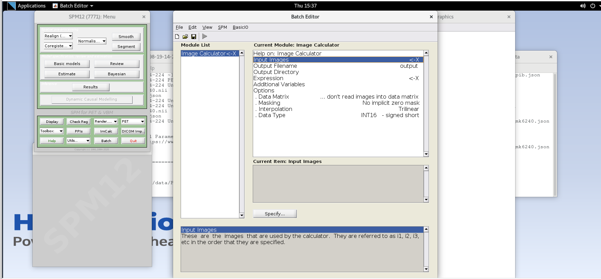
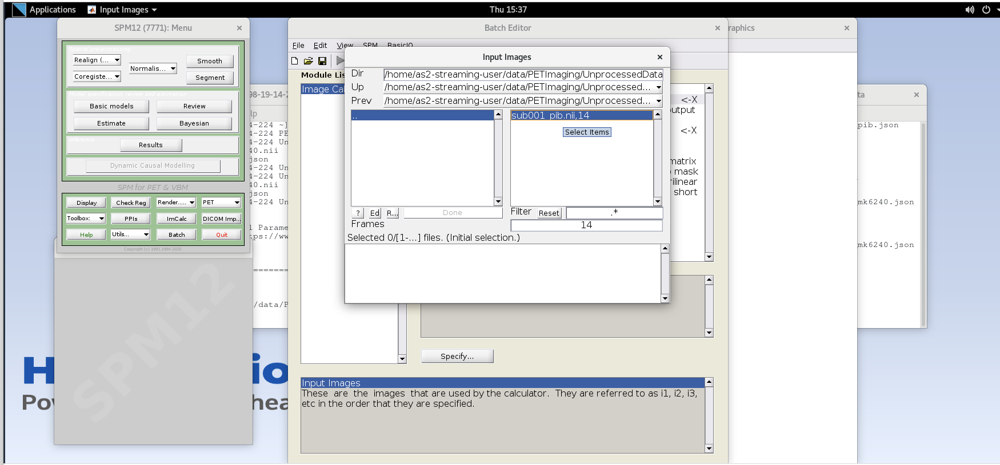
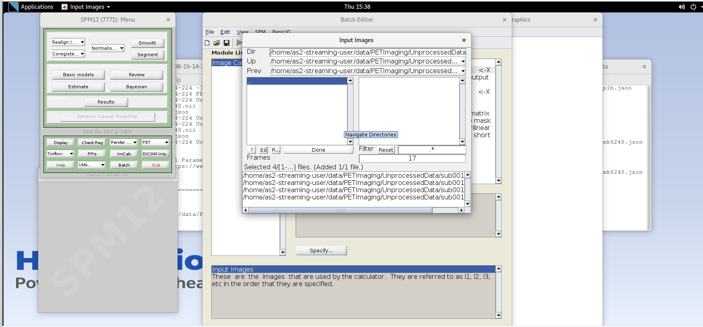
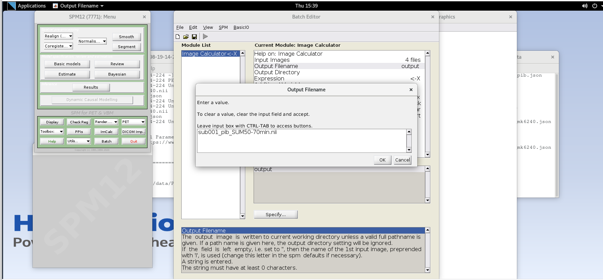
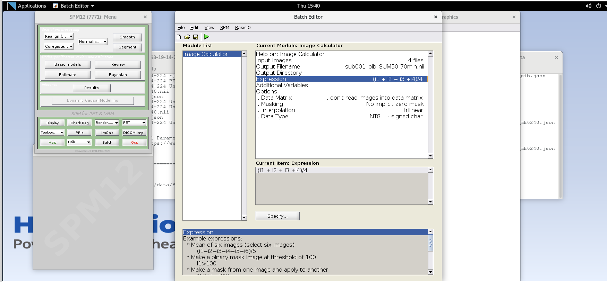
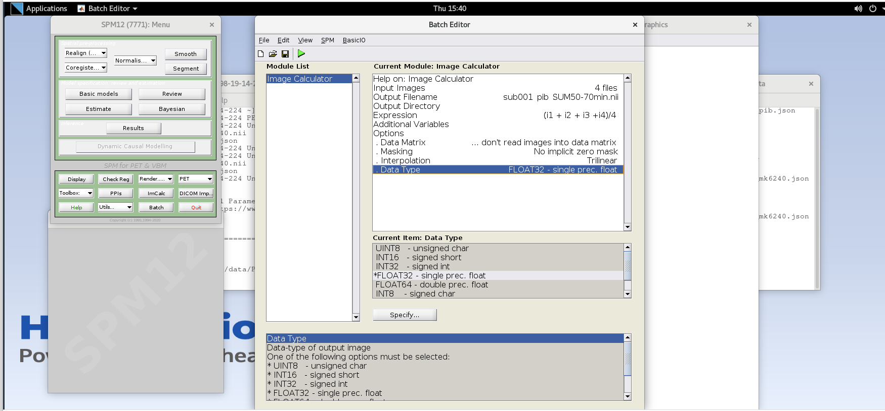

:::::::::::::::::::::::::::::::::::::: questions 

- What does positron emission tomography measure?
- What are some common processing steps used for PET quantification?
- How can I extract key measurements of tracer binding from dynamic PET data?

::::::::::::::::::::::::::::::::::::::::::::::::

::::::::::::::::::::::::::::::::::::: objectives

- Understand the basic structure of 4D PET data and key variables needed for quantification.
- Explain the differences between static and dynamic acquisitions, and what 
information can be derived from them.
- Perform the basic processing steps involved in PET image quantification and analysis.

::::::::::::::::::::::::::::::::::::::::::::::::

## Introduction

This tutorial is an introduction to working with PET data in the context of AD 
neuroimaging. Due to the limited time, we will not have time to fully recreate 
a typical image processing pipeline for PET data, but
have included enough steps that you’ll be able to perform the minimum steps 
needed to generate a parametric SUVR image. The provided dataset includes 
T1-weighted MRI, [18F]MK-6240 tau PET and [11C]PiB amyloid PET scans for a 
single subject at a single timepoint. For ease, the T1-weighted image was
already rigidly aligned and resliced to a 1mm isotropic image in MNI152 space. 
The provided PET scans were acquired using different protocols to demonstrate 
two common ways that PET data can be acquired. The tutorial will explain the 
differences between these types of acquisitions and what information
can be derived from them.

### Background: PET data, image processing, and quantification
PET data are collected on the scanner typically in *list mode*. This is quite 
literally a logged record of every event the scanner detects, but this 
type of data is not all that useful for interpretation. Viewing the images
requires that the list mode data be reconstructed. The provided images 
have already been reconstructed with the widely-used Ordered Subset 
Expectation Maximization (OSEM) algorithm with common corrections 
(scatter, dead time, decay, etc.) already applied during the reconstruction. 
Notably, no smoothing was applied during the PET reconstruction.

## Gaining familiarity with 4D PET data
### Prepare working directory
1. Open a new terminal window and navigate to the directory with the 
unprocessed PET NIfTI images and data `/home/as2-streaming-user/data/PET_Imaging`.
1. Use `ls` to view the contents of this directory
1. Use `cd` to change your working directory to the following location: 
    ```bash
    cd /home/as2-streaming-user/data/PET_Imaging/UnprocessedData
    ```
    
### View PET metadata
View the information in the .json file for MK-6240 and PiB images by 
opening the .json files for the MK-6240 and PiB images. For example, type the 
following into the terminal:

```bash
gedit sub001_pib.json
```

::::::::::::::::::::: hint
Open up multiple terminal windows to view the .json file contents 
side-by-side.
::::::::::::::::::::::::::    

* Note that the Time section differs with regard to the scant start and 
injection start times. Namely, the MK-6240 scan starts 70 minutes after 
tracer injection, whereas the PiB image starts at the same time as the 
tracer injection. The latter acuisition protocol is often referred to as a _full dynamic_ acquisition 
and enables us to calculate more accurate measurements like distribution 
volume ratio (DVR) and often additional parameters from the time-series
data (e.g., $R_1$ relative perfusion). If we had arterial data available, we 
could also use the full dynamic scan to perform kinetic modeling.
* Also note the framing sequences differs between the two tracers. 
MK-6240 is using consecutive 5-minute frames whereas PiB starts with 
2-minute frames for the first 10 minutes and then 5-minute frames thereafter.
* For both images, the decay correction factors correspond to the scan 
start time (indicated by “START” in the DecayCorrected field). This may 
or may not have consequences for how we quantify the image. For example, 
if we wanted to calculate the standard uptake value
    $SUV = C(t) / InjectedDose * BodyMass$,
    
    we would need to decay correct the MK-6240 scan data to tracer injection 
    but this is not needed to calculate SUV for the PiB scan because the scan 
    started with tracer injection.
    
Now close the .json files in `gedit`.

### View 4D PET data
1. Open `sub001_pib.nii` using `fsleyes`.
1. Set the minimum threshold to 0 and the maximum threshold to 30,000 Bq/mL
1. You are currently viewing individual PET frames that have not been 
denoised in any way. Notice the high noise level in the individual PET 
frames. This is why we often apply some type of denoising algorithm to the 
PET data before processing and quantification.
1. Use your cursor to scroll around the image and observe the values in 
voxels in the brain. These values are activity concentrations given in 
$Bq/mL$, where Bq (Becquerel) is the SI unit for radioactivity and is 
expressed as a rate (counts per second). In PET, the noise in the image 
is proportional to the inverse of the square root of the counts. Thus, the 
more counts detected, the less noisy the image will appear.
1. Use the Volume field to advance through the PET frames from the first 
frame (index = 0) to the last frame (index = 16). Moving higher in volume 
indices is moving forward in time, like a 3D movie, as the tracer 
distributes throughout the brain over time. Note how the distribution of 
the tracer changes from the first frame to the last frame. The tracer 
distribution in early frames of this acquisition largely reflects the tracer 
perfusing the brain tissue whereas later frames largely reflect a 
combination of free tracer and specific and non-specific tracer binding. 
You may need to adjust the upper window level to a lower value to more 
clearly visualize the later PET frames. You’ll also likely notice that the 
later frames are noisier than the beginning frames, again, this has to do 
with counting statistics and the reduced counts detected over time due to 
radioactive decay and lower tracer concentration in the brain at later 
timepoints.
1. Close the 4D PET image in FSL by selecting the image in the Overlay list 
at the bottom of the page and clicking Overlay -> Remove from the menu at 
the top of the page.

## Creating a SUM PET image
We’ll create two different SUM images from the PiB scan; one for early- and one
for late-frame data to visualize the differences in tracer distribution between 
these timepoints more easily. The early frame data will SUM 0-20 minutes 
post-injection whereas the late frame will SUM 50-70 minutes post-injection.
We’ll do the late-frame image first and then the early-frame image. You can 
reference the FrameTimeStart and FrameTimeEnd fields in the .json file to 
determine which frames correspond to 0-20 min and 50-70 min postinjection.

### Using ImCalc to Sum Frames
1. Open SPM12 by typing `spm pet` in the command line.
1. Select the `ImCalc` module.
    {alt="SPM ImCalc module"}
1. For each variable in the GUI, you will need to specify values using the `Specify` button.
Use the values specified below for each variable listed.
   * `Input Images` – here we want to specify the input images that we are going to
use to perform the image calculation. The order that the images are specified will
determine the order they are referred to in the expression field below (e.g., the
first image is i1, the second image is i2, etc.,) However, SPM will only load one
frame at a time for 4D data, so each frame needs to be specified individually
using the Frames field. The frame number is then delineated by the filename
followed by a comma and the frame number. Note that SPM uses index 1 for the
first frame, which corresponds to index 0 in FSL.
   * Enter the frame number corresponding to the frame that spans 50-55
   min post-injection (frame number 14) and hit enter. Click on the
   `sub001_pib.nii,14` file to add this to the list. 
        {alt="Choose Frame 14"}
   * Enter the next framenumber and similarly add it to the list. Repeat until 
   you’ve added the last four frames of the PiB image corresponding to 
   50-70 min post-injection (frames 14, 15, 16, and 17). Note the order you 
   input the images corresponds to i1, i2, ... in the Expression field later. 
   Once you’ve selected the last four frames click Done to finalize the selection.
        {alt="Choose all"}
   * `Output Filename` – enter text `sub001_pib_SUM50-70min.nii`
       {alt="ImCalc output"}
   * `Output Directory` – specify the output directory for the file. If you 
   leave this blank, SPM will output the file in the present working directory 
   (i.e., the directory that SPM was launched from in the command line)
   * `Expression` – because the frames are all 5 minutes long at this part of 
   the sequence, we can simply take the average to sum the last 20 
   minutes of counts.
   
       Enter the expression
       
       ```matlab
       (i1 + i2 + i3 +i4)/4
       ```
       
       Note that taking the average of these frames is equivalent to summing 
       all of the detected counts across the frames and dividing by the total 
       amount of time that has passed during those frames (i.e., 20 min).
       {alt="ImCalc expression"}
    * `Data Matrix`, `Masking`, `Interpolation` can all use default values
    * `Data Type` – specify FLOAT32
       {alt="Choose float image"}
1. Verify ImCalc inputs and then run the batch by pressing the green play
button at the top of the batch editor. This should create a new NIfTI file 
with the late-frame summed data.
1. Open the 50-70 min SUM image in FSLeyes and note the difference in noise 
properties vs. those you observed in a single frame. (note: you will likely 
need to use different thresholding to see the image; e.g., 0-20,000 Bq/mL) The SNR has improved 
because we are now viewing an image with more total counts. Notice that you 
can now more clearly see some contrast between the precuneus and the adjacent 
occipital cortex in the sagittal plane just to the left or right of 
mid-sagittal. You can similarly see differences in intensity between much of 
the cortex and the cerebellar GM, a common reference region used for amyloid 
PET as it typically has negligible specific binding in the cerebellum.

    **Do you think this person is amyloid positive or negative?**
1. Repeat the above steps to generate the SUM image for the early frame data. 
Make sure to remove the previous volumes before adding the new volume in the 
Input Images. You will need to use the first seven frames corresponding to the 
first 20 min of data. Note that the frames are not all the same duration and a 
straight average is no longer equivalent to summing all of the counts and 
dividing by the total time. How can we use a weighted average to account 
for the differences in frame durations between the first five and last two 
frames of the first 20 minutes?

    ```matlab
    (i1*2 + i2*2 + i3*2 + i4*2 +i5*2 + i6*5 + i7*5) / 20
    ```
1. Name this file `sub001_pib_SUM0-20min.nii`
1. Open the 0-20 min SUM image in FSLeyes and compare to the 50-70 min SUM 
image. Note the differences in GM/WM contrast between the images and the 
differences in noise properties. You will likely have to change the max 
intensity settings in both images to be able to observe the differences 
in contrast.
1. Close the SPM batch editor

## Image Smoothing
As you can see from viewing the unsmoothed images, they are still quite noisy, 
particularly at the voxel level. In this section we’ll use a simple Gaussian 
smoothing kernel to reduce the voxel-level noise. We are
really trading voxel variance for co-variance between voxels. This means that 
the activity concentration in any particular voxel will have lower variance, 
but will be more influenced by neighboring voxels. Thus, we are degrading the 
spatial resolution of the image slightly to improve the noise characteristics. 
The size of the Gaussian smoothing kernel is typically specified as the 
full-width of the kernel at half the maximum value of the kernel.

### Apply smoothing to SUM images
1. Click on the Smooth button to launch the Smooth module in SPM and use the following
inputs:
   * `Image to Smooth` - Specify the two SUM images (you can do both at the same
time)
   * `FWHM` – 4 4 4 (this specified an isotropic 4 mm full-width half Gaussian
smoothing kernel)
  * `Data Type` – Same
  * `Implicit Mask` – No
  * `Filename prefix` – ‘s’ (this prepends an “s” onto the filename to 
  indicate the newly created image was smoothed)
1. Press the green play button to run the smoothing module.
1. Close the SPM batch editor.
1. View the resultant smoothed images in FSL (the ones with an ‘s’ prefix in 
the filename). Note the reduction in voxel-level noise but also the 
slight reduction in spatial resolution.

## Intermodal Registration
While we can quantify PET images without anatomical data like T1-weighted MRI, 
we can gain considerable regional detail if we align our PET images to an 
anatomical reference. This section will use SPM12’s `Coregister` module 
to register the PET data to a T1-weighted MRI. We’ll first view the
problem in FSL to demonstrate why we need to register the images and 
then perform the co-registration to align the PET data to the T1-w MRI.

### View images in FSL
1. Open the `rsub001_t1mri.nii` and in FSL. Use the down arrow next to the Overlay list to
move the T1 to the bottom of the list. Select the T1 and set the window min and max to
0 and 1,400, respectively.
1. Select the smoothed 50-70 min SUM PIB image in the viewer and adjust the min and
max window level to 0 and 30,000 respectively. Select the `Hot [Brain colours]` colormap
for the PET image. Reduce the Opacity slider down until you can see both the MRI in the
background and the PET image in the foreground.
1. Notice that the images are not aligned. Thus, we cannot yet use the structural MRI to
extract regional PET data. We first need to register the PET image to the

### Coregister PET to T1-weighted MRI. 
**Caution: SPM will overwrite the transformation matrix in
the Source Image and Other Image! As such, we will first create a safe copy of our SUM and 4D
images before running the Coregistration module).**

1. Create copies of the smoothed late-frame SUM image and the 4D pib image.
   a. In the terminal, create a new directory called “safe” in your working directory.
   
        ```bash
        mkdir safe
        ```
   a. Copy the `ssub001_pib_SUM50-70min.nii` and `sub001_pib.nii` images to the safe
directory using the cp command in the terminal.

        ```bash
        cp ssub001_pib_SUM50-70min.nii safe/ ssub001_pib_SUM50-70min.nii
        ```
1. Open the Coregistration module by selecting `Coregister (Est & Res)` from the Spatial pre-
processing drop down. This function will estimate the parameters needed to align the
source image to the reference image, write those transformations to the NIfTI headers
for those files and will create new images with the image matrices resliced to align voxel-
to-voxel with the reference image.
   * Select `rsub001_t1mri.nii` for the reference image.
   * Select the smoothed 50-70 SUM image for the source image. `ssub001_pib_SUM50-70min.nii`
   * Optional: if you’d like to also apply this registration to the 4D data, Select the 4D
data for Other Images. You will need to enter each volume in the 4D image to
apply the transformation matrix to each frame in the time series, or you can
specify a subset of the frames to create a 4D image with just some frames
included.
   * We will use default values for `Estimation Options`
   * In the `Reslice Options` Set Interpolation to “Trilinear” and masking to “Mask
Images”
1. Press the green play button to register the PET data to MRI.

### Review registration results
1. In FSL, remove all of the loaded images using the Overlay>Remove All command.
1. Open the T1-weighted MRI and the resliced registered SUM PET image `rssub001_pib_SUM50-70min.nii` in FSLeyes.
1. Select the SUM image. Select the `Hot [Brain colours]` colormap for the SUM PET
image and set the min to 0 and max to 25,000.
1. Use the opacity slider to make the SUM PET image ~50% translucent.
1. Scroll around in the image to view the registered SUM PET image overlayed on
the T1-weighted MRI. Notice the PET image now aligns with the MRI. Also note
the elevated binding in the precuneus, cingulate cortex, and frontal, parietal and
temporal cortices.
1. Also observe the registration accuracy by looking at features common to (i.e.,
mutual information) both T1-weighted MRI and PiB PET. For example, elevated
non-specific PiB binding can be observed in the cerebellar peduncles (white
matter) and a lack of tracer uptake is observed in the CSF filled spaces like the
lateral ventricles which are also low intensity on the T1-w MRI.
1. Compare the image headers for the SUM image in the safe directory with the
SUM image with the same name that was used as the source image for
registration. You can show the header info in the terminal using `fslhd` or select
Setting>Ortho View1>Overlay Information in FSLeyes. Notice that the sform
matrix parameters have changed to reflect the spatial transformation needed to
align the PET image to the T1-weighted MRI. This allows a viewer to show the
PET image aligned to the T1-w image in world coordinates without having to
alter the image matrix.
1. Now compare the image headers for the resliced SUM image `rssub001_pib_SUM50-70min.nii` with the T1-weighted MRI. The matrix size
and sform matrix should be identical. This is because SPM resliced the PET
image matrix such that the image matrix itself now aligns with the T1-weighted
MRI, and thus no transformation in the header is needed to align the images in
the viewer.

## Create a standard uptake value ratio (SUVR) image
In this section, we will use the registered sum image and the T1-weighted MRI to create a cerebellum GM
ROI and generate a parametric SUVR image. We’ll do all of these steps using FSL commands and
functions. We’ll first create a hand-drawn ROI in the inferior cerebellum based on the MRI, and then use
this mask to intensity normalize the SUM PET image and create our SUVR image. Note that we are
specifically using the 50-70 min SUM image to generate the SUVR image as this is the timepoint wherein
PiB has reached a pseudo “steady state” wherein binding estimates are more stable.

### Create a hand-drawn cerebellum GM ROI
1. In `fsleyes`, turn off the PET overlay.
1. Turn on Edit mode by selecting Tools -> Edit Mode
1. In the image viewer, navigate to the inferior portion of the cerebellar GM (~Z voxel
location 30). You should be 1-2 axial planes below the inferior GM/WM boundary in the
cerebellum.
1. Select the T1-w MRI in the Overlay list and click the icon on the left side of the viewer
that looks like a sheet of paper to create a 3D mask using the T1-w image as a reference.
1. Rename the mask `rsub001_cblm_mask` using the text box on the top-left side of
FSLeyes
1. Using the pencil and fill tools, hand draw circles in the left and right inferior cerebellum
on the transaxial plane. Use the fill tool to fill in the inner part of the circle. Ensure the
Fill value is set to 1. Using a Selection size of 3 voxels or greater will help draw the ROI
more easily. When you’re done drawing your ROI, click the select tool to enable you to
scroll around the image viewer.
1. Select the mask image and save the image (Overlay -> Save) as a new NIfTI file named `rsub001_cblm_mask.nii.`

### Create the SUVR Image with the inferior cerebellum reference region
1. For the expression, we want to divide the SUM 50-70 min pib image by the mean
intensity in the cerebellum ROI that we just generated by hand. To accomplish this, we
will divide the entire SUM pet image by the mean of the SUM PET image in all voxels
where the cerebellum mask =1. We’ll do this in two steps using FSL.
1. In the command line, extract the mean activity concentration in the cerebellum mask
using fslstats

    ```bash
    fslstats rssub001_pib_SUM50-70min.nii -k rsub001_cblm_mask.nii -M
    ```
    ```output
    TODO: add output
    ```
1. Create the SUVR image by dividing the SUM 50-70min image by the mean activity
concentration output by `fslstats`

    ```bash
    fslmaths rssub001_pib_SUM50-70min.nii -div {ROI mean} rssub001_pib_SUVR50-70min.nii
    ```

### View the SUVR image overlayed on the T1-w MRI
1. Open the T1-weighted MRI (if not already opened) and the newly created pib SUVR
image `rssub001_pib_SUVR50-70min.nii` in FSLeyes.
1. For the SUVR image, set the colormap to `Hot [Brain colours]`, set the min and max
intensity window to 0 and 3, and set the opacity to ~50%.
1. Notice the values within the image have been rescaled and should be roughly between 0
and 3 SUVR. For interpretation, values ~>1 (plus some noise) in the gray matter indicate
specific tracer binding to beta-amyloid plaques.

:::::::::::::::::::: discussion
- **Which regions do you suspect have amyloid plaques?** 
- **Which regions have the highest density of amyloid plaques?**
::::::::::::::::::::::::::::

## Stretch Exercises
If you have time, please try the following challenge to test your knowledge.

:::::::::::::::::::: challenge
### SUVR versus DVR images
We have pre-processed the PiB image using a different image 
pipeline that outputs distribution volume ratio (DVR) images instead of SUVR. 
These are located in the folder `~/data/PETImaging/ProcessedPiBDVR` in the file
`cghrsub001_pib_DVRlga.nii`
Compare the DVR image with the SUVR image you created in the tutorial. 

*How are the images similar and how are they different?*

:::::::::::::::::::: hint
Pay close attention to the display settings for the window and colormap.
::::::::::::::::::::
::::::::::::::::::::

:::::::::::::::::::: challenge
### Create a Tau PET SUVR image
You have created a SUVR image for PiB, which used a dynamic acquisition wherein 
the scan started at the same time as tracer injection. Now see if you can 
repeat the relevant steps above to create a SUVR image for the MK-6240 scan. 

::::::::::::::::::::::::::: hint
You’ll need to look at the .json file for the TAU PET NIfTI file - this will
contain key information around timing and 
framing so that you can determine which frames to SUM to generate the SUVR image. 
The most commonly used MK-6240 SUVR windows are 70-90 min or 90-110 min 
post-injection. For most tau tracers, the inferior cerebellum is a valid 
reference region. If you run out of time and would like to view an MK-6240 SUVR 
image, you can view the 
images in `~/data/PETImaging/ProcessedTutorial`, which have been pre-processed. 
::::::::::::::::::::::::::::::::
::::::::::::::::::::::::::::::::

## Additional steps
In the tutorial above, some steps that would typically be included in PET processing were omitted to
enable enough time to get through the tutorial and create an SUVR image during the workshop. For
example, we did not include interframe alignment and did not perform any smoothing or denoising on
the 4D PET data. We have included additional steps below and have also included some preprocessed
PiB data using a DVR pipeline that you can compare with your SUVR image.

### Interframe realignment
Interframe realignment is often included in processing 4D PET data to correct for motion between
frames in a dynamic acquisition. It’s important to note that this process will not correct for motion that
happens within a PET frame and will also not correct for misalignment of the emission scan and
attenuation map used during the reconstruction. As such, correcting for interframe motion does not
entirely account for motion that occurs during a PET scan. In cases with large amounts of motion, the
reconstructed data may need to throw out bad frames or may simply be unusable. There are some
approaches to correct for motion on the scanner and prior to/during reconstruction, but this is beyond
the scope of this tutorial. We will use the 4D PiB data and SPM12 to perform interframe realignment, but
will modify our approach to account for differences in PET frame duration and noise.

1. View the problem
   a. In the previous tutorial, we created SUM images of the first and last 20 minutes of the
PiB acquisition. Load these images in FSLeyes. Recall that you’ll need to use the 50-70
SUM image in the /safe directory that did not have the coregistration transformation
matrix written to the NIfTI header. If you have not completed the tutorial, you can load
the following images that have been previously processed:
      * `/home/as2-streaming-user/data/PET_Imaging/ProcessedTutorial/ssub001_pib_SUM0-20min.nii`
      * `/home/as2-streaming-user/data/PET_Imaging/ProcessedTutorial/safe/ssub001_pib_SUM50-70min.nii`
   a. Set the threshold for the min and max window to 0 to 35,000 for the 0-20 min SUM
image and 0 to 20,000 for the 50-70 min SUM image.
   a. Toggle the top image on and off using the eye icon in the Overlay list. Notice the slight
rotation of the head in the sagittal plane between the early and late frames. This is due
to participant motion during the scan acquisition and what we are going to attempt to
correct using interframe realignment.
   a. Close FSLeyes.
2. Launch SPM if not already opened
3. Smooth all frames of the 4D data – smoothing prior to realignment will improve the registration
by reducing voxel-level noise.
   a. Select the Smooth module from SPM
   a. Add all frames for the 4D PiB image `sub001_pib.nii` to the Images to smooth
   a. Set the FWHM to an isotropic 4 mm kernel (4 4 4).
   a. Set the datatype to FLOAT32
   a. Press the green play button to execute the smoothing operation
   a. Close the smooth module in SPM
   a. View the smoothed 4D PiB image in FSLeyes.
4. SUM PET frames across the 4D acquisition
   a. For interframe realignment, we typically create an average image of the entire 4D time
series to use as a reference image to align each frame. Because the PiB framing
sequence has different frame durations, we cannot simply average the frames as we
would in fMRI, but instead need to create a SUM image of the entire 70-minute
acquisition using a weighted average.
   a. Open the `ImCalc` module in SPM.
   a. Specify all frames of the smoothed 4D PiB image (ssub001_pib.nii) as Input Images. Be
sure to maintain the frame order on the file input.
   a. Name the output file `ssub001_pib_SUM0-70min.nii`
   a. For the expression, specify an equation for a frame duration-weighted average of all
frames. Recall that the frame durations are stored in the .json file.

        ```matlab
        (i1*2 +i3*2 +i4*2 +i5*2 +i6*5 +i7*5 +i8*5 +i9*5 +i10*5 +i11*5 +i12*5 +i13*5 +i14*5 +i15*5 +i16*5 +i17*5)/70
        ```
   a. Use FLOAT32 for the Data Type
   a. Run the module using the green play arrow.
   a. Close the SPM `ImCalc` module.
5. Perform Interframe alignment using SPM12 realign
   a. Open the Realign: Estimate and Reslice module in SPM12
   a. Select data and click Specify
   a. Select Session and click Specify
      i. Here we will use the SUM0-70 min image as the reference for realignment. This is done by selecting this file first in the session file input list.
      i. Select the SUM 0-70 min PiB image, and then specify the entire smoothed 4D time series by input each of the 17 frames.
      i. Use default settings for all parameters except the following
         - `Estimation Options-Smoothing (FWHM)`: 7
         - `Estimation Options-Interpolation`: Trilinear
         - `Reslice Options-Resliced Images`: Images 2..n
         - `Reslice Options-Interpolation`: Trilinear
      i. Run the module by clicking the green play icon
   a. Once the process has completed, the SPM graphics window will output the translation
and rotation parameters used to correct for motion in each frame. Note these are small
changes typically <1-2 mm translation and <2 degrees rotation.
   a. Close the SPM realign module
   a. View the resultant 4D image in FSLeyes (`rssub001_pib.nii`) using a display min and max
of 0 to 30,000. Navigate in the viewer to view the sagittal plane just off mid-sagittal.
Place your crosshairs at the most inferior part of the orbitofrontal cortex and advance
through the PET frames. How did the realignment perform? Are you still seeing rotation
in the sagittal plane between early and late frames?
   a. Now change the max window to 100 to saturate the image and view the outline of the
head. Scroll through the frames to look for any head motion across the frames. To see
the difference before and after realignment, load the smoothed 4D image, saturate the
image to view the head motion between frames.

## Appendices 1: Filenames and descriptions
### Filenames and Descriptions
Unprocessed files (`/home/as2-streaming-user/data/PET_Imaging/UnprocessedData/`):

* `rsub001_t1mri.nii` – T1-weighted MRI NIfTI image
* `sub001_mk6240.nii` – 4D [18F]MK-6240 PET NIfTI image
* `sub001_pib.nii` – 4D [11C]PiB PET NIfTI image
* `sub001_mk6240.json` – metadata for MK-6240 PET scan
* `sub001_pib.json` – metadata for PiB PET scan

Processed files in order of tutorial creation (`/home/as2-streaming-user/data/PET_Imaging/ProcessedTutorial/`):

* PiB SUVR tutorial
  * `sub001_pib_SUM50-70min.nii` – PiB PET summed from 50-70 min post-injection
  * `sub001_pib_SUM0-20min.nii` – PiB PET summed from 0-20 min post-injection
  * `ssub001_pib_SUM50-70min.nii` – SUM50-70 min PiB image smoothed by 4mm kernel
  * `ssub001_pib_SUM0-20min.nii` – SUM0-20 min PiB image smoothed by 4mm kernel
  * `rssub001_pib_SUM50-70min.nii` – smoothed SUM50-70 min PiB image registered and resliced to T1-weighted MRI
  * `rsub001_cblm_mask.nii.gz` – mask image of hand-drawn cerebellum ROI
  * `rssub001_pib_SUVR50-70min.nii` – PiB SUVR image registered to T1-weighted MRI
* MK-6240 SUVR tutorial
  * `sub001_mk6240_SUM70-90min.nii` – PiB PET summed from 70-90 min post-injection
  * `ssub001_mk6240_SUM70-90min.nii` – SUM70-90 min MK-6240 image smoothed by 4mm kernel
  * `rssub001_mk6240_SUM70-90min.nii` – smoothed SUM70-90 min MK-6240 image registered and resliced to T1-weighted MRI
  * `rssub001_mk6240_SUVR70-90min.nii.gz` – MK-6240 SUVR image registered to T1-weighted MRI

Processed PiB DVR in order of creation (`/home/as2-streaming-user/data/PET_Imaging/ProcessedPiBDVR/`):

  * `ssub001_pib.nii` – smoothed 4D PiB time series
  * `sub001_pib_SUM0-70min.nii` – PiB SUM 0-70 min
  * `rsub001_pib.nii` – realigned 4D PiB time series
  * `hrsub001_pib.nii` – realigned 4D PiB time series with HYPR denoising applied
  * `hrsub001_pib_SUM0-20min.nii` – denoised PiB SUM 0-20 min used for source image in SPM coregistration to T1-weighted MRI
  * `cghrsub001_pib_SUM0-20min.nii` – denoised PiB SUM 0-20 min image coregistered and resliced
to T1-weighted MRI
  * `cghrsub001_pib.nii` - denoised 4D PiB image coregistered and resliced to T1-weighted MRI
  * `cghrsub001_pib_DVRlga.nii` – PiB DVR parametric image coregistered to T1-weighted MRI (Logan
graphical analysis, $t^*$=35 min, $k_2’$=0.149 $min^{-1}$, cerebellum mask reference region)
  * See the file descriptions earlier in the appendix for remaining descriptions of images in this directory

## PiB DVR Pipeline
Smooth 4D data (3 mm) -> SUM 0-70 min for realignment reference -> Interframe Realignment -> HYPR
Denoising -> SUM 0-20 min for coregistration source image -> Coregister to MRI -> Extract cerebellum
GM reference region time-activity curve -> Generate parametric DVR image

::::::::::::::::::::::::::::::::::::: keypoints 

- PET Images are reconstructed from listmode data.
- The most commonly used PET tracers are sensitive to amyloid plaques and
neurofibrillary tau tangles.
- Full dynamic scans are acquired from the time of injection, while static 
scans are acquired a fixed interval after injection when the tracer has or is
approaching equilibrium
- Summing individual frames together reduces the level of noise
- SUVR images represent the relative uptake in each voxel to a reference region,
where there is likely no specific binding

::::::::::::::::::::::::::::::::::::::::::::::::

