:::::::::::::::::::::::::::::::::::::: questions 

- How do I process and quantify structural MRI scans?
- How do I register MRI with other modalities?
- How do I get key metrics out?

::::::::::::::::::::::::::::::::::::::::::::::::

::::::::::::::::::::::::::::::::::::: objectives

- Perform basic pre-processing steps, such as bias correction and tissue 
segmentation
- Assess some common imaging artefacts in the sturctura MRI
- Discover how to align and quantify neuroimaging data at regional level

::::::::::::::::::::::::::::::::::::::::::::::::

## Introduction

In this section, you will be learning how to process and quantify structural 
MRI scans. T1-weighted structural MRI scans are the "workhorse" scan of dementia
research. They provide high-resolution, detailed pictures of a patient's 
anatomy, allowing researchers to visualize where atrophy caused by Alzheimer's 
disease or other dementias is occurring. In addition, it provides anatomical 
reference to other imaging modalities, such as functional MRI and positron 
emission tomography (PET), that provide lower-resolution maps of brain function 
and pathology, so that regional quantification of key areas can be assessed 
in these scans.

We will be using two widely used software packages: 
[SPM](https://www.fil.ion.ucl.ac.uk/spm/) and 
[FSL](https://fsl.fmrib.ox.ac.uk/fsl/fslwiki). These packages provide analysis 
and visualization functionality of structural and functional neuroimaging data, 
and they can be used in both cross-sectional and longitudinal studies. The 
subsequent outputs from these pipelines can be used in the quantification of 
other imaging modalities. 

After the course, you will be able to perform basic measurements relevant to 
dementia research from structural MRI brain scans. 

We will use the SPM and FSL tools to perform:

- image visualization of analysis outputs,
- intensity inhomogeneity correction, 
- structural MRI segmentation,
- quantification of volumetric outputs, and 
- registration to a standard space atlas. 

## Opening up an image
We are going to be working in the `StructuralMRI` subfolder under `data` in 
your home directory.From the previous lesson, you learned how to view and 
navigate images.

Clicking on the Applications in the upper left-hand corner and select the 
terminal icon. This will open a terminal window that you will use to type 
commands
{alt="Launch the terminal"}
 
From the terminal window, type `fsleyes` to open up the image and have a 
look around.
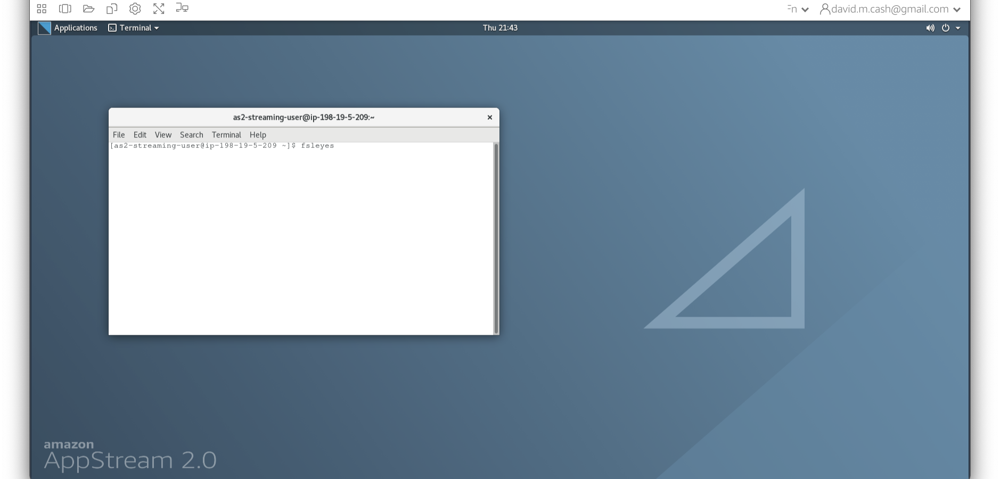{alt="Open FSLeyes"}

Now we choose the file `sub-OAS_30003_T1w.nii` by going to the File menu and 
choosing the Add Image command
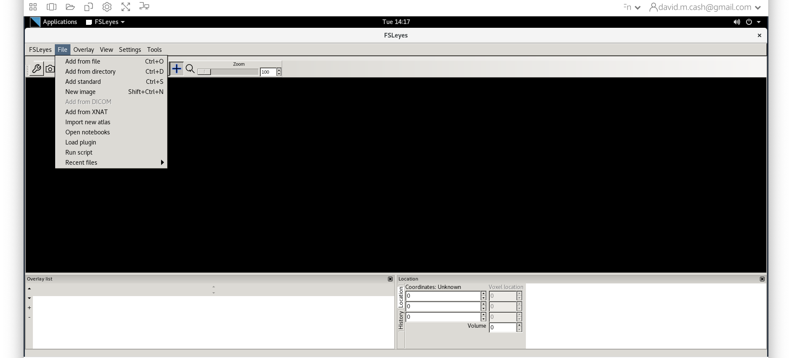{alt="Add file"}
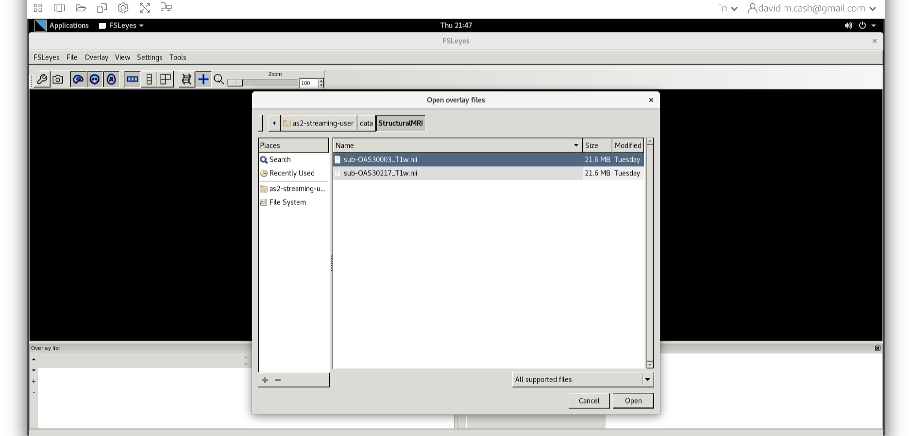{alt="Choose File"}

:::::::::::::::::::::::  challenge
### Exercise 1
Close fsleyes and then re-open the viewer. This time use the other image 
in the folder `sub-OAS30217_T1w.nii`. 

*What differences do you notice?*
::::::::::::::::::::::::::::::::

## Run Bias Correction and Tissue Segmentation

Small variations in the magnetic field can result in changes in the image 
intensity that vary slowly spatially. These variations are not due to 
anatomical differences. We can visually identify this *image inhomogeneity* 
in the white matter, where voxels in one part of the brain might be so affected 
by it that they have similar intensity values as grey matter voxels in other 
brain regions. However, the intensities in the white matter voxels should be 
more or less uniform throughout the brain. Any remaining inhomogeneity in the 
image can significantly influence the results of automated image processing 
techniques, so we need to correct for these effects. The process that removes 
this image inhomogeneity is typically referred to as *bias correction*. 

The next step is to reliably identify what type of tissue each voxel contains. 
While the resolution of structural MRI is quite high (typically around 1 mm), 
there is still the likelihood that a voxel will contain more than one tissue 
in it. The process of *tissue segmentation* looks at the voxel intensity, 
compares it to its neighbours and prior information about what tissues we 
would expect to have in that voxel and assigns a probability that the voxel 
contains that tissue. It typically generates *n* different volumes, where *n* 
is the number of tissue types you want to use to classify the brain. We 
typically focus on three tissue probability maps in particular:

* Grey matter (GM), 
* White matter (WM), and
* Cerebrospinal fluid (CSF)

SPM performs the *bias correction* and *tissue segmentation* steps 
simultaneously. Follow the steps below to obtain bias-corrected images and 
tissue probability maps. 

### Bias Correction and Segmenation Steps
1. Type `spm pet` to launch SPM 
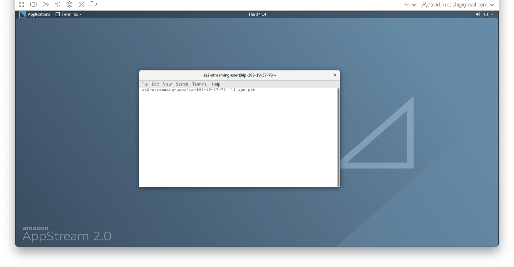{alt="Launch SPM"}
1. SPM will then create a number of windows. You want to look at the Main Menu
Window that has all of the buttons.
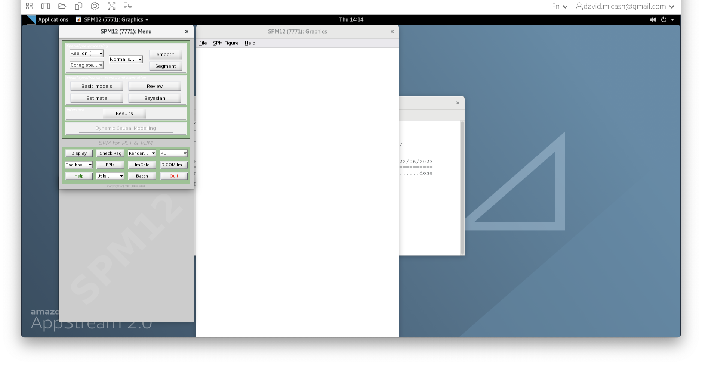{alt="SPM windows"}
1. From main menu, select the Segment button. This will launch a 
window known as the *batch editor*, where you can adjust settings on the pipeline to be run.
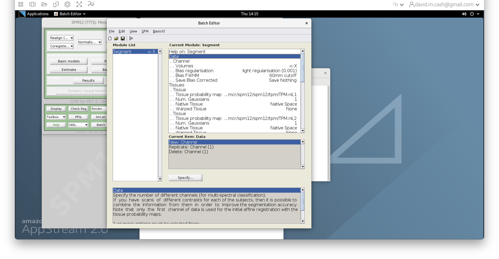{alt="SPM Batch editor"}
1. Edit the options for segmentation:
   a. Under Data->Channels->Volume, click on "Specify...".
    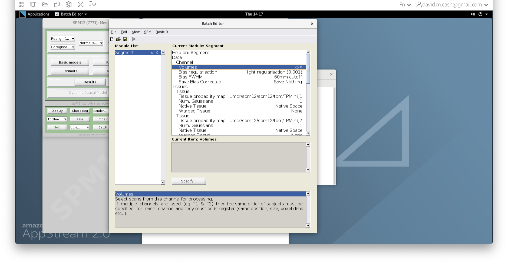{alt="Specify volumes"}
   a. In the dialog box that opens up, please navigate to the folder `data` and 
   then `StructuralMRI`. Then select the first image `sub-OAS30003_T1w.nii`. 
   Once you click on it, you will notice the file move down to the bottom of 
   the box which represents the list of selected files.
    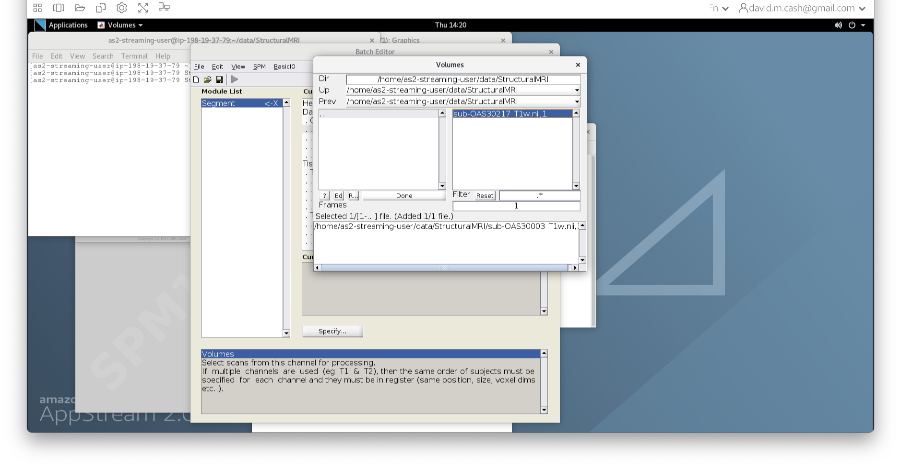{alt="Choose T1 image"}
   a. Click the `Done` button
   a. Back in the batch editor, under Data->Save Bias Corrected, please 
   choose "Save Field and Corrected" 
   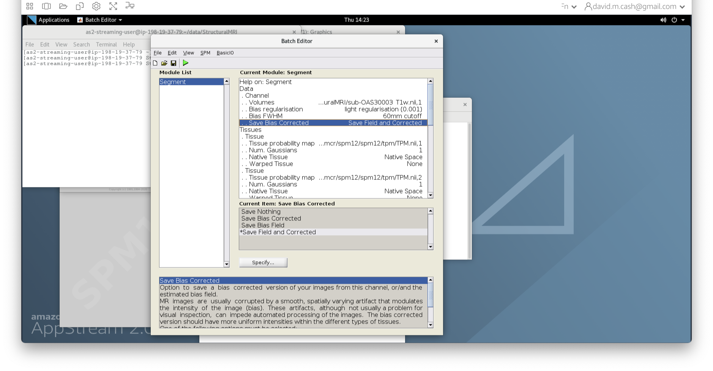{alt="Choose bias correction option"}
   a. Under the Tissues section, please make sure that the first three tissue 
   types, which represent GM, WM, and CSF, have the native tissue subfield set 
   to native, while the final three tissue types (4-6), which represent 
   non-brain structures, have the native tissue subfield set to None.
   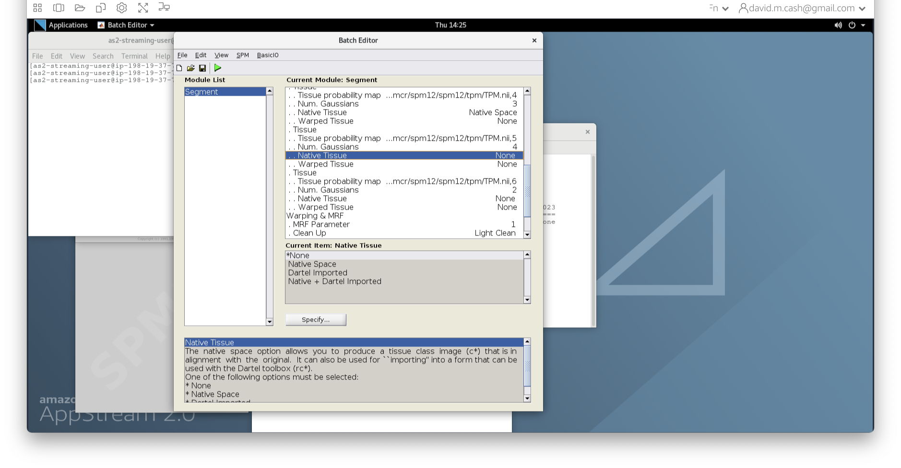{alt="Native segmentation"}
1. Click the green run button to start! It should take about 5-10 minutes. You 
will see a lot of other things happening in other windows. The terminal will 
say `Done - Segment` when it has finished.

::::::::::::::::::::: spoiler
### Reproducing your work
When you are using these workflows for your actual research, we **highly 
recommend** that you save the SPM pipelines so that you could run them again on
the exact same data
with the exact same settings. You can do that by selecting `Save batch` from
the `File` menu. This will save the batch, or pipeline, as a file with a
`.mat` extension. You can load this file back in by selecting the `Load batch`
from the `File` menu and selecting the file you save. 

:::::::::::::::::::::
 
## Quality check
The quality check is an important part of any analysis. We are going to 
visualize the outputs from SPM Segment and make sure that the bias correction 
and segmentation have worked. 

### Bias correction
1. Use `fsleyes` again and open up the original image `sub-OAS30003_T1w.nii` 
as you did at the start of the session.
2. Change the image lookup table to `NIH [Brain colors]` 
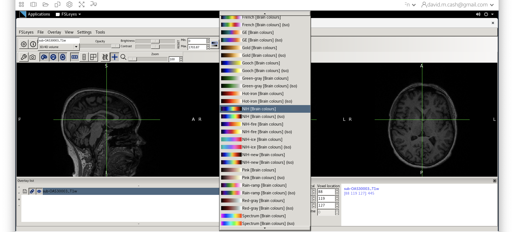{alt="FSL eyes with NIH colormap"}
3. Then change the image minimum to 40 and the maximum to 600. This means that 
all intensities 40 and below will map to the first color in the lookup table, 
and all voxels 600 and above will map to the last color. The white matter 
should be yellow to red. 
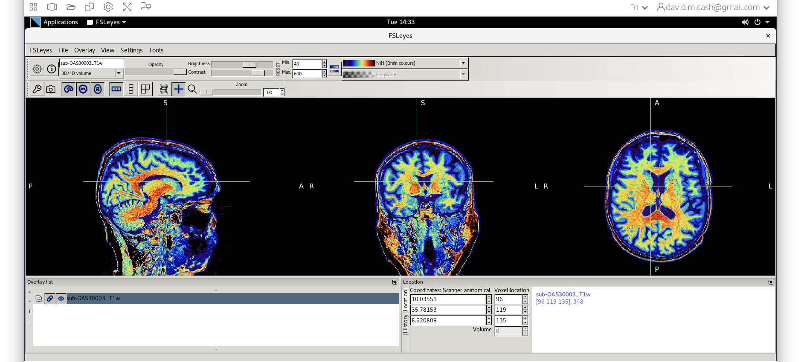{alt="Change min and max intensity"}   
4. Next add the  bias corrected image, which is called `msub-OAS30003_T1w.nii`. 
Change the lookup table to NIH as you did in Step 2. Change the minimum to 40 
and maximum intensity to 500 similar to what you did in Step 2 and 3. 
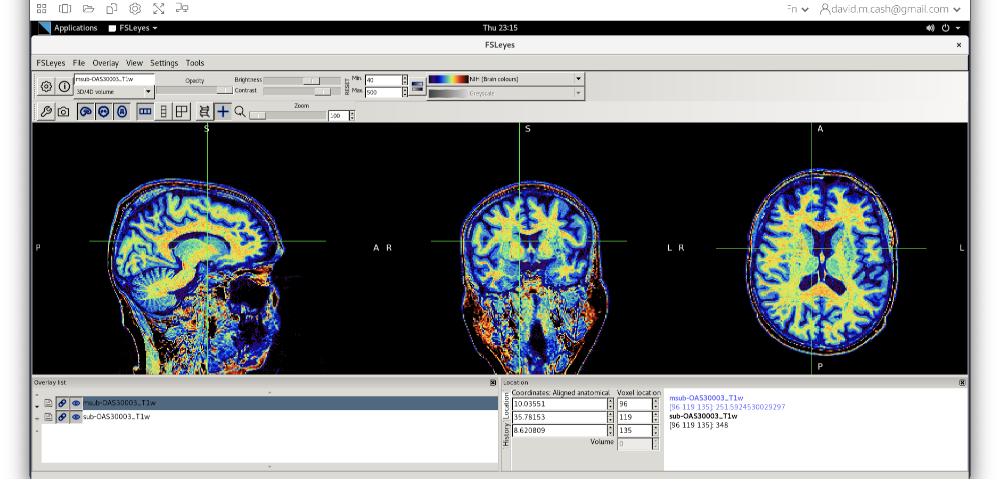{alt="Bias in image using NIH map"}   

When you add this image, it will overlay on top of the original image. 
Think of this new image a completely opaque, so that you no longer see the 
original one. If you want to see the original one, then you need to either 
turn it off using the eye icon ( {alt="eye icon" height='24px'} )
right by the file, or you need to turn the 
opacity (slider near the top of the screen which is marked opacity.)

::::::::::::::::::::: challenge
### Exercise 2
Use the eye icon in the overlay list right next to the file 
`msub-OAS30003_T1w.nii` and turn this image off and on many times. This will 
allow you to compare with the original image. 

*What do you notice about the image in the white matter area when comparing 
the bias correct and original image?*
:::::::::::::::::::::::::::::::

### Tissue segmentation
Now that we are happy with the bias correction, lets look at the tissue 
segmentation.

1. Use the icon to turn off the original image. Select the bias corrected 
image and make sure the colormap is back to the first option "Greyscale"
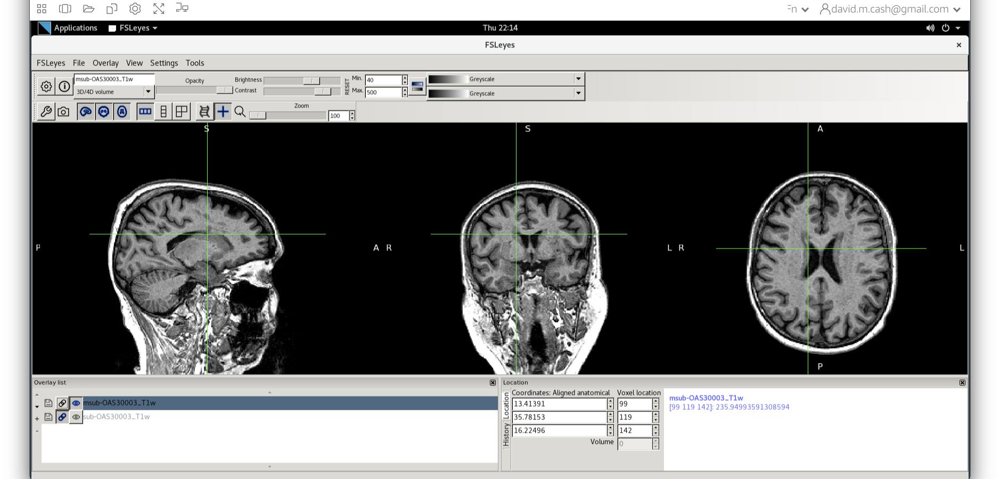{alt="Bias correted image in greyscale"}
1. Now add the grey matter probability image `c1sub-OAS30003_T1w.nii`. 
1. Choose the probability map and set the lookup table to Red. Change the 
minimum intensity to 0.2 and the maximum intensity to 0.9. This will eliminate 
some noise from very low probability voxels.
1. Use the opacity slider to make the grey matter probability map transparent.
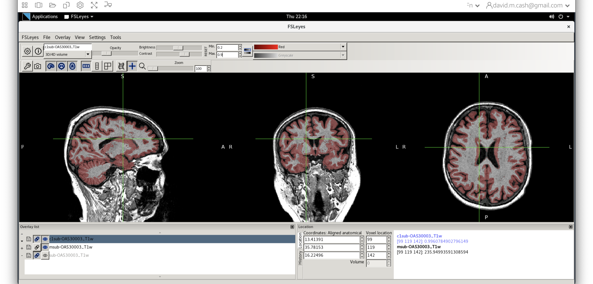{alt="Looking at grey matter image"}
1. Look around the image, zoom in places, and try turning the grey matter 
probability map off and on. The goal is to make sure the grey matter 
probability map is not:
   a. Missing any grey matter
   a. Not including other tissue (WM, CSF, non-brain tissue that has a 
   similar intensity to GM)

:::::::::::::::::::::::::: challenge
### Exercise 3
Now do the same steps with the white matter image `c2sub-OAS30003_T1w.nii` and
the cerebrospinal fluid image `c3sub-OAS30003_T1w.nii`. Choose different color 
colormaps. 

*Do these images look like they have identified the white matter and CSF in 
the T1 weighted image correctly?*

:::::::::::::::::::::::::::::::::::: solution
You should have an output that looks something like this.
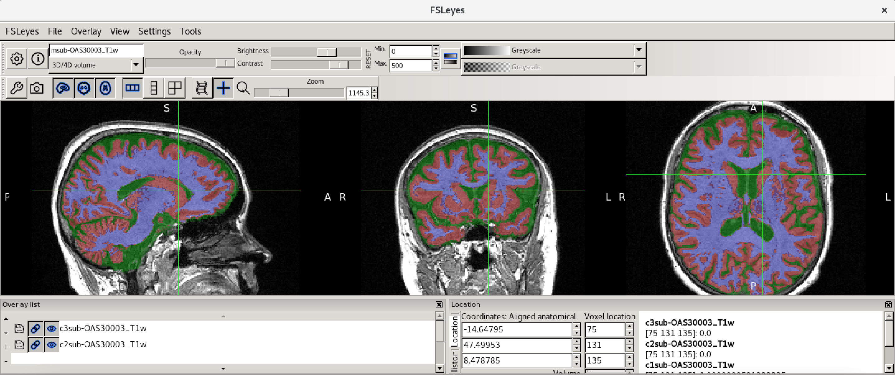{alt="Tissue segmentation check"}
::::::::::::::::::::::::::::::::::::
::::::::::::::::::::::::::::::::::::

## Obtaining volume
One thing that we are often interested in is to obtain the actual volume of 
grey matter, or a particular brain region. There are helpful utilities in FSL 
to extract the volume from the tissue probability maps. 
First we will change our working directory to the Structural MRI folder:
```bash
cd ~/data/StructuralMRI
```
Then we will run this command to get the total grey matter volume:
```bash
fslstats c1sub-OAS30003_T1w.nii -V
```
```output
719954 961026.312500
```
This will produce two numbers. The first number is the number of voxels in the 
grey matter. These voxels as discussed earlier have physical dimensions 
indicating how the volume that each individual voxel represents. So the second 
value indicates the total volume of the grey matter (usually represented in 
units of cubic millimeters, 1$ml$ = 1000$mm^3$).


## Coregistration to standard space
MRI scans can be acquired in any orientation. Even when we think we are 
getting a sagittal or coronal acquisition, the patient may end up in the 
scanner at a slant. This makes it difficult to identify key anatomical 
landmarks. We may also want to compare common anatomical structures across a 
whole sample of subjects. The main solution to this is to use 
*image registration* to orient our images and align them with a standard 
anatomical coordinate system. In this case, we will be aligning our data to 
the Montreal Neurological Institute 
[MNI152 atlas](https://mcin.ca/research/neuroimaging-methods/atlases/). 
We are not looking to perform an exact voxel to voxel match between our image 
and the atlas. Instead, we just want to align the images such that the 
orientation and the relative size are aligned.

### Skull stripping
Before we can perform the registration, we will use the tissue probability 
maps to *skull strip* the image. Skull stripping removes the non-brain tissue 
(scalp, dura, neck, eyes, etc) from the image. Before we run the commands, 
let's first check what working directory we are in by using the command `pwd`:
```bash
pwd
```
```output
/home/as2-streaming-user/data/StructuralMRI
```
If you have a different output from the above, then run the following command:
```bash
cd ~/data/StructuralMRI
```

First we will use the FSL utility `fslmaths` to create a brain mask by using 
the tissue probability maps from SPM. `fslmaths` is a great swiss-army knife 
utility to do lots of helpful little image processing bits. 

```bash
fslmaths c1sub-OAS30003_T1w.nii -add c2sub-OAS30003_T1w.nii -add c3sub-OAS30003_T1w.nii -thr 0.5 -bin sub-OAS30003_T1w_brain_mask.nii
```

Let's break this command down a little bit:

- First, we state the command we want to run `fslmaths`
- We then specify our input image, the GM map `c1sub-OAS30003_T1w.nii`
- We then specify the first operation `-add`
- We then specify what we want to add to our input image. In this case, it is 
the WM map `c2sub-OAS30003_T1w.nii`. The resulting image would contain the 
probability that a voxel is either GM or WM.
- We then specify that we want to add another image, and this time it is the 
CSF map. This image now holds the probability that a voxel is GM, WM, or CSF, 
which are the three main tissue types in the brain that we want to process.
-  We will then threshold this image at 0.5 using the `-thr 0.5` option. This 
says to only keep voxels who have a probability of 0.5 or greater. All other 
voxels are set to 0. 
- Our final operation is to *binarize* the image. Any values that are not 
zero are set to one. This creates a mask which says whether the voxel is 
inside (**1**) or outside (**0**) of the brain.  
- Finally, we save our results into the new image file 
`sub-OAS30003_T1w_brain_mask.nii`

Now that we have created a mask, we are going to remove all the information 
outside of the mask using the following command:
```bash
fslmaths msub-OAS30003_T1w.nii -mas sub-OAS30003_T1w_brain_mask.nii.gz msub-OAS30003_T1w_brain.nii
```
This command masks our bias corrected image with the brain mask and makes 
a new file which has the name `msub-OAS30003_T1w_brain.nii`. Take a look at the
image in `fsleyes`.
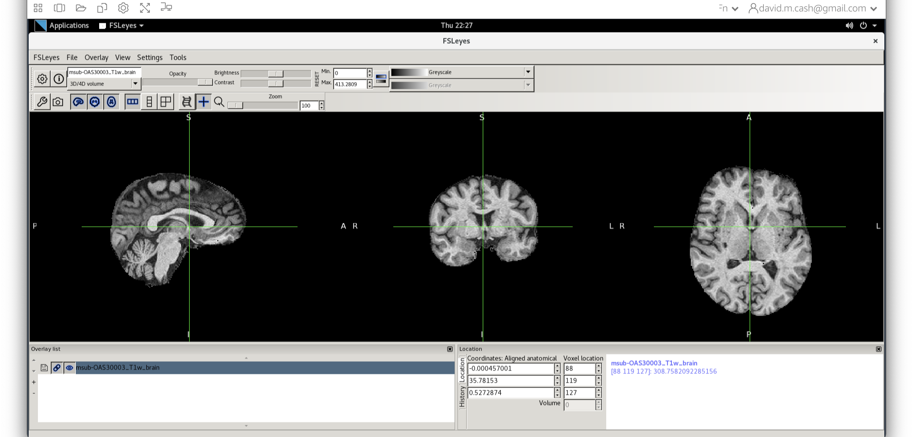{alt="Skull stripped image"}

We will then use the FSL registration program 
[FLIRT](https://fsl.fmrib.ox.ac.uk/fsl/fslwiki/FLIRT) to align our image to the 
standard space MNI152. Please follow the steps below:

1. On the terminal window, please type in the following command `Flirt`
1. This will open a dialog box. We will change the following settings:
   a. For reference image, click on the folder icon and choose the image `MNI152_T1_1mm_brain`
   a. For the input image, please select the mask we created above `msub-OAS30003_T1w_brain.nii`
   a. For the output image, please type in a new name `msub-OAS30003_T1w_brain_MNI.nii`
The final command setup should look like the screenshot below.
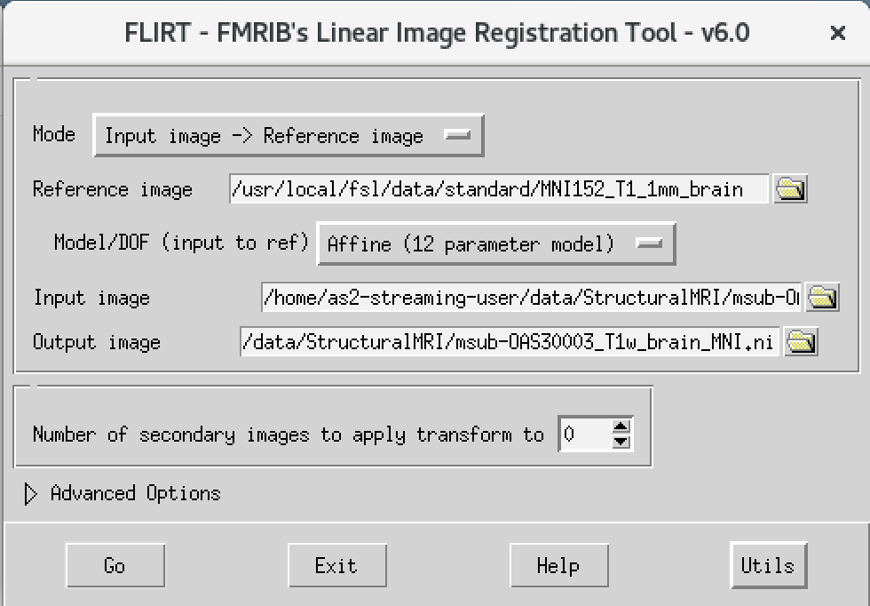{alt="FLIRT window"}

If your window looks like this, then click the **Go** button at the bottom, 
in the terminal, you will see the *command line* program that would run what 
you have set up in the dialog box. If you were to select that command and run 
it in the terminal it would do the same thing. 

### Quality check
Let's open `fsleyes` and open the output from the co-registration 
`msub-OAS30003_T1w_brain_MNI.nii`.
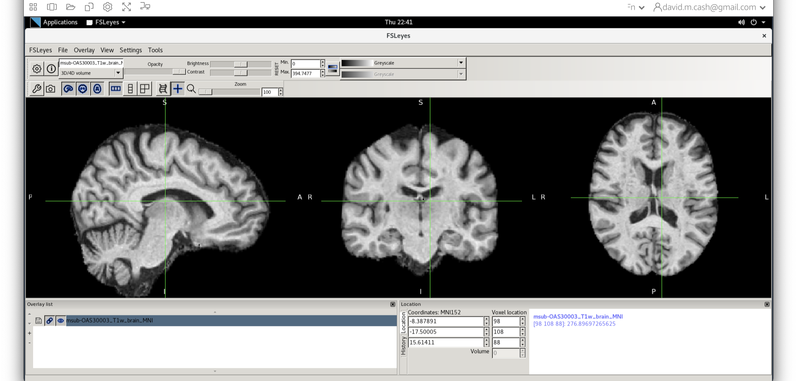{alt="T1w in MNI space"}

Now click on the Add Standard function. This is where fsleyes keeps all of the 
standard atlases and templates so that you can quickly access them.
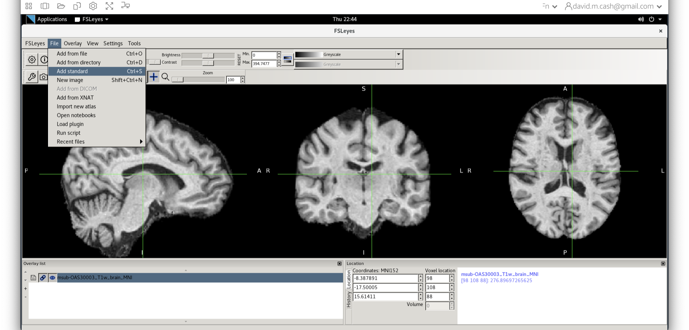{alt="Add standard function"}

Select the `MNI152_T1_1mm_brain` from this list of files.
{alt="Choose MNI image"}

We can now check if our image is registered by flicking back and forth between 
the MNI image and our image. 

## Stretch exercises
If you have completed all of the above and want to keep working on more 
structural imaging data, please try the exercises below. 

:::::::::::::::::::::::::: challenge
### BONUS Exercise 1
Extract the volumes from the WM and CSF probability maps for `sub-OAS30003_T1w.nii`.

*What are the three tissue volumes?*
::::::::::::::::::::::::::
:::::::::::::::::::::::::: solution
```bash
# This is the same command as above to get the GM volume out
fslstats c1sub-OAS30003_T1w.nii -V
# Now for the WM volume
fslstats c1sub-OAS30003_T1w.nii -V
# Finally, for the CSF volume
fslstats c1sub-OAS30003_T1w.nii -V
```
```output
719954 961026.312500
462937 617948.687500
599177 799807.750000
```

:::::::::::::::::::::::::: 

:::::::::::::::::::::::::: challenge
### BONUS Exercise 2
The volumes that come out of `fslstats` assume that each voxel is completely 
full of GM, even though for some voxels the probability may be very small. That 
can lead to inaccuracies, so there are a couple of ways we can more accurately 
measure from tissue probability maps.

Before we start, let's make sure we are in the right working directory by 
using the `cd` command.
```bash
cd ~/data/StructuralMRI
```

The first approach is to only count voxels with a **majority** of GM. So we 
will threshold by the value of 0.5 before calculating our volume.
```bash
fslstats c1sub-OAS30003_T1w.nii -l 0.5 -V
```
```output
465968 621994.569978
```
The second approach is to get the mean and volume of the all the non-zero voxels.
```bash
fslstats c1sub-OAS30003_T1w.nii -M -V
```
```output
0.641076 719954 961026.312500
```

This will produce three numbers:

1. The mean of the non-zero voxels
2. The number of voxels greater than zero.
3. The volume of the voxels greater than zero.

If you multiply (1) by (3), this would be what we call the *probabilistic* 
volume of the GM and it accurately accounts the amount of GM in each voxel, 
which should give you a volume of around 616,090.

*How do these volumes compare with the original volume you obtained?*
::::::::::::::::::::::::::

:::::::::::::::::::::::::: challenge
### BONUS Exercise 3
Let's take a look at our other image `sub-OAS30217_T1w.nii`. 
Perform the same steps as you did for the first image:

- Segmentation
- Skull Stripping
- Co-registration to standard space Run the same skull stripping and 
registration as you have done before. Now open up both standard space 
images in `fsleyes`

*What do you observe about the images?*
::::::::::::::::::::::::::

::::::::::::::::::::::::::challenge
### BONUS Exercise 4
Let's now try to co-register two imaging modalities from one participant 
(*within-subject registration*)

```bash
cd ~/data/ExtraStructuralMRI
ls
```
At the end of the previous session on data visualization, you looked at a 
T1-weighted scan and a FLAIR scan from the same participant 
(`sub-OAS30003_T1w.nii.gz` and `sub-OAS30003_FLAIR.nii.gz`, load them again in 
FSLeyes if you need a refresh). As you will have noticed, they have different 
dimensions, resolution and orientation, so if we want to look at the same 
point in the brain in both images we need to align them.

First, we need to choose which image we want to keep unchanged 
(*reference*) and which one we want to align to the reference (*input*). Let's 
assume we want to register the FLAIR image to the T1. We have already prepared 
a skull-stripped version of the images for you so they are ready to be aligned 
with [FLIRT](https://fsl.fmrib.ox.ac.uk/fsl/fslwiki/FLIRT).

The way to do this is very similar to what you did before to co-register a T1 
to standard space.
Please follow the steps below:

1. On the terminal window, type `Flirt`
1. This will open the dialog box you used before. The new settings are:
   a. For reference image, delete the text in the box and type 
   `~/data/ExtraStructuralMRI`, then click on the folder icon and choose the 
   image `sub-OAS30003_T1w_brain.nii.gz`
   a. Change the Model/DOF (input to ref) to `Rigid Body (6 parameter model)`
   a. For the input image, click on the folder icon and choose the image 
   `sub-OAS30003_FLAIR_brain.nii.gz`
   a. For the output image, please type in a new name `sub-OAS30003_FLAIR_to_T1w.nii.gz`

The final command setup should look like the screenshot below:
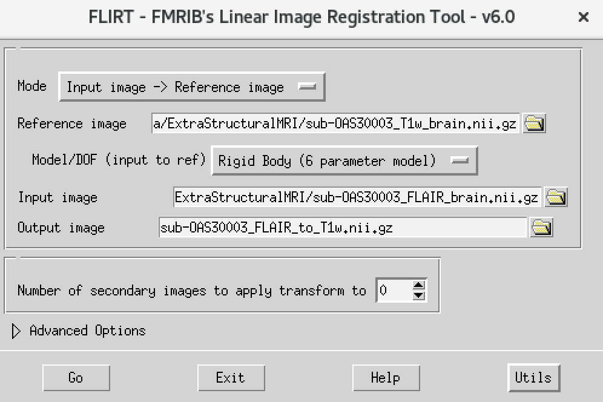{alt="Coregistration of T1 and FLAIR"}

If your window looks like this, then click the **Go** button at the bottom, in 
the terminal, you will see the *command line* program that would run what you 
have set up in the dialog box. If you were to select that command and run it in 
the terminal it would do the same thing. 

Once done, open the result in FSLeyes:

```bash
fsleyes sub-OAS30003_T1w_brain.nii.gz sub-OAS30003_FLAIR_to_T1w.nii.gz &
```
We can now check if our image is registered by flicking back and forth between 
the T1 image and the FLAIR registered image.

*Can you think of why the registered FLAIR image appears blurred in the 
sagittal and coronal plane?*

Now try to do the opposite: co-register the T1 to the FLAIR.

*What differences do you notice with respect to the previous case 
(FLAIR co-registered to T1)?*

*Can you think of different cases where you would want to use T1 or 
FLAIR as your reference?*
::::::::::::::::::::::::::
::::::::::::::::::::::::::::::::::::: keypoints 

- Structural MRI provides high-resolution anatomic information for neuroimaging
analysis
- Bias correction removes image inhomogeneities
- Tissue segmentation identifies key tissue types (grey matter, white matter, 
cerebrospinal fluid) from T1 weighted images
- Co-registration of MRI to other modalities can be used to analyse these images
at a regional level.

::::::::::::::::::::::::::::::::::::::::::::::::

